# Making sounds with DISSCO and LASSIE

Create your first audio file, then learn to change its pitch, timing, tone color, and effects. No programming or MIDI keyboard is needed.

**Start with sections 1–9:** build and hear one five-second tone. **Continue through section 10:** change one setting at a time and listen as it becomes a five-tone piece. **Choose sections 11–23 as needed:** they are independent experiments and references, not prerequisites for finishing your first piece. Save at any completed checkpoint and return later.

**LASSIE** is the editor; DISSCO's **CMOD** engine renders the sound. **Save** stores the project. **Project > Run**, with **Sound Synthesis** checked, creates audio. This is what “synthesize” means here; there is no separate Synthesize button.

Two projects provide starting and recovery points:

| Project | What you will hear | Use |
| --- | --- | --- |
| [first_tone.dissco](examples/tutorial_sound/first_tone.dissco) | One centered tone fading in and out | End of section 9; experiments 11–19 and 23 |
| [tutorial_sound.dissco](examples/tutorial_sound/tutorial_sound.dissco) | Five tones with varied pitches, stereo movement, and reverb | End of section 10; experiments 20–22 |

To try a supplied project, download it into its own working folder. On GitHub, use **Download raw file** on the file page. Choose **Open Project**, accept **Project Properties**, and follow [Run and listen](#run-and-listen). Its objects and envelopes already exist.

Screenshots show English LASSIE at high resolution. Open an image to view it at full size; window styling can vary by operating system.

## Contents

**Get started — build a sound, then change it**

- [1. Install and open LASSIE](#1-install-and-open-lassie)
- [2. Understand the project structure](#2-understand-the-project-structure)
- [3. Create a project](#3-create-a-project)
- [4. Learn how to enter values and functions](#4-learn-how-to-enter-values-and-functions)
- [5. Set up Top 0](#5-set-up-top-0)
- [6. Create Bottom s1](#6-create-bottom-s1)
- [7. Draw an amplitude envelope](#7-draw-an-amplitude-envelope)
- [8. Create Spectrum sp1](#8-create-spectrum-sp1)
- [9. Connect and hear your first tone](#9-connect-and-hear-your-first-tone)
- [10. Turn one tone into a short piece](#10-turn-one-tone-into-a-short-piece)

**Optional experiments — start each section from its stated project**

- [11. Change pitch and carrier phase](#11-change-pitch-and-carrier-phase)
- [12. Set loudness](#12-set-loudness)
- [13. Work with envelopes](#13-work-with-envelopes)
- [14. Build richer spectra](#14-build-richer-spectra)
- [15. Place sounds in space](#15-place-sounds-in-space)
- [16. Add reverberation](#16-add-reverberation)
- [17. Shape the tone with filters](#17-shape-the-tone-with-filters)
- [18. Add sound modifiers](#18-add-sound-modifiers)
- [19. Apply modifiers to individual partials](#19-apply-modifiers-to-individual-partials)
- [20. Control modifier chances and exceptions](#20-control-modifier-chances-and-exceptions)
- [21. Arrange a longer piece](#21-arrange-a-longer-piece)
- [22. Use functions, patterns, sieves, and Markov models](#22-use-functions-patterns-sieves-and-markov-models)
- [23. Reuse objects and manage projects](#23-reuse-objects-and-manage-projects)

**Help**

- [24. Troubleshooting and final checklist](#24-troubleshooting-and-final-checklist)

## 1. Install and open LASSIE

Follow [Downloading DISSCO](../DOWNLOAD.md) for your system. On macOS, follow [Building DISSCO on macOS](../BUILDING_MACOS.md). Open **LASSIE** after installation.

You should see the **New Project**, **Open Project**, and **Save** buttons. Maximize or enlarge the window so that labels and the right side of each field are visible. The right-hand **Event Attributes** area can scroll independently of the **Objects List** on the left.

Save projects in your own working folder, such as Documents. Keep them outside the application bundle, installation directory, and DISSCO source directory.

**Optional first listen:** open the supplied [first_tone.dissco](examples/tutorial_sound/first_tone.dissco) from its own working folder and follow [Run and listen](#run-and-listen). Hearing its single tone confirms the installation and playback path before you build anything. Then choose **New Project** in section 3 to build your own version.

## 2. Understand the project structure

An **event** describes something that happens in time. A **parent** creates other events or sounds, called its **children**. The project uses three objects in Objects List and two curves in Envelope Library. LASSIE creates Top 0 when you make a new project; you will add Bottom s1, Spectrum sp1, and the curves.

| Object or library entry | What it does in this example |
| --- | --- |
| **Top 0** | Represents the whole piece. It creates one instance of Bottom s1. |
| **Bottom s1** | Creates one sound first, then five in section 10. Sets their start times, durations, pitches, and loudness. |
| **Spectrum sp1** | Describes the ingredients inside each sound. Our first spectrum has one sine-wave partial. |
| **Envelope 1** | A triangle that gives the partial a fade in and fade out. Section 10 also uses it to move the sound between speakers. |
| **Envelope 2** | A horizontal curve with value 1. With scale 0.5, it keeps the first tone centered between two speakers. |

The connection is **Top 0 → Bottom s1 → Spectrum sp1**. Merely creating objects does not connect them: you will drag the child into its parent's child table.

Names such as **Bottom s1** combine the object's type (**Bottom**) and name (`s1`). In **Create New Object**, type only `s1` in the name field. An **instance** is one use of an object during a run: Top can create several instances of the same Bottom without you creating several Bottom objects.

A **partial** is one component of a sound. Adding partials changes the tone color, also called **timbre**. An **envelope** is a curve that describes how a value changes over time.

## 3. Create a project

1. Click **New Project**.
2. Choose a working folder, enter `first_tone` as the filename, and click **Save**. LASSIE creates a project folder with the same name and places `first_tone.dissco` inside it.
3. In **Project Properties**, enter the values below.

| Setting | Value |
| --- | --- |
| Project Title | `first_tone` |
| File Flag | Keep the default `THMLBsnv` |
| Number of Channels | `2` — stereo |
| Sample Rate | `44100` — audio samples per second (Hz) |
| Sample Size | `24` — bits per sample |
| Number of Threads | `1` |
| Sound Synthesis | Checked |
| Score Printing | Unchecked |
| Grand Staff | Unchecked |
| Output Particel | Checked |
| Top Event | Keep `0` |
| Piece Duration | `30` — seconds |

**Output Particel** produces a `.particel` text report for checking generated events. **Number of Threads** controls rendering workers. Keep it at `1` for these exercises; the staff settings are for score output.

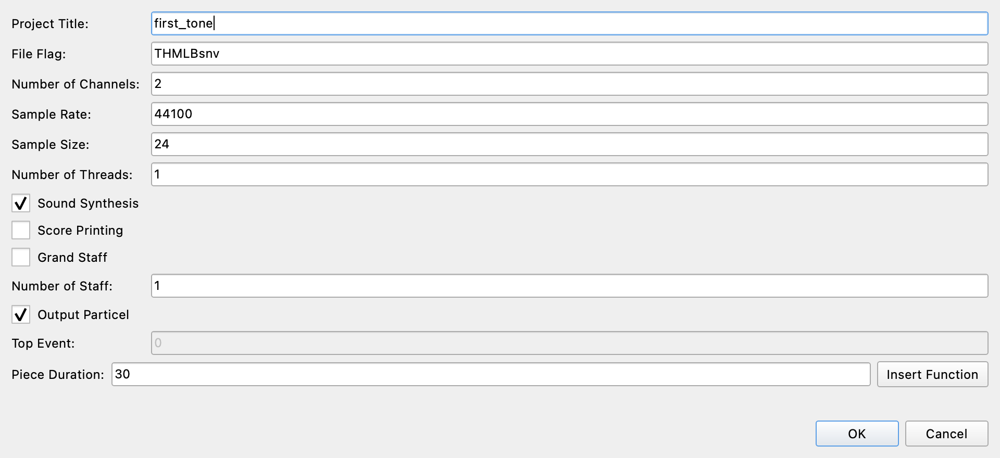

Click **OK**. You can return to these settings through **Project > Set Properties**.

Check **Sample Size = 24** even when opening an older project: LASSIE preserves its saved setting.

## 4. Learn how to enter values and functions

- Enter numbers without units: type `440` for 440 Hz. Enter lists in list fields; use one value per cell in tables.
- **Project > Run** means open the Project menu and choose Run.
- **Insert Function** and **fn** open **Function Generator** beside the receiving field. Sections 5–6 use plain numbers; section 8 walks through your first function.
- A function's **Result String** may begin with `<Fun>`. Edit its labeled parameter fields; LASSIE writes the expression. Long results scroll horizontally. Reopen the function with **Insert Function** or **fn** to edit it.
- When one function contains another, click **OK** in the inner dialog, then **OK** in the outer dialog. **Cancel** discards that dialog's changes.
- Press **Tab** or click another field to finish an entry, then **Save**.

Some fields need an **envelope**, even for a constant value. Those fields use **EnvLib** or **MakeEnvelope**; a bare number cannot replace the curve. You will build and use both kinds in this tutorial.

## 5. Set up Top 0

1. In **Objects List**, click the small arrow beside the **Top** folder.
2. Double-click the child row **Top 0**, rather than the folder heading.
3. Set the following fields in **Event Attributes**. Scroll down if necessary.

| Area | Setting | Value |
| --- | --- | --- |
| Number of Children | Method | **Fixed** |
| Number of Children | Number of Children To Create | `1` |
| Children Events Definition | Method | **Continuum** |
| Children Events Definition | Child Start Time | `0` |
| Children Events Definition | Start Time unit | **Seconds** |
| Children Events Definition | Child Type | `0` |
| Children Events Definition | Child Duration | `30` |
| Children Events Definition | Duration unit | **Seconds** |
| Below the definition | Max Child Duration | `30` |

Keep the default tempo and time signature. They become relevant when you use musical time in EDUs later.

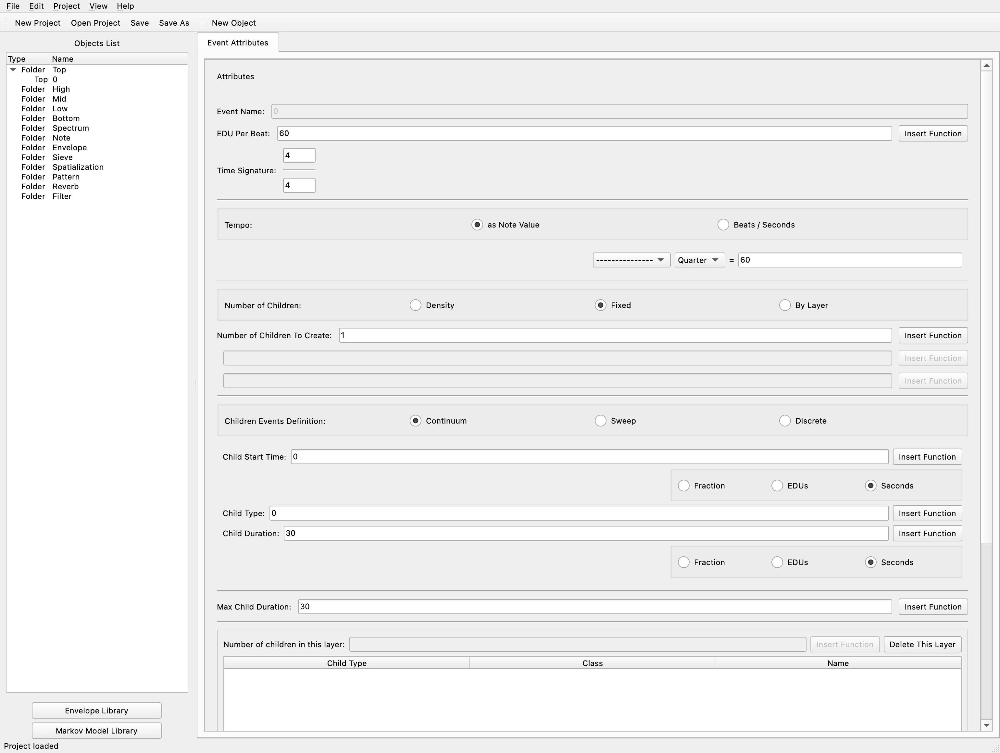

Here, **Child Type 0** means the first row in this event's child table. It does not mean “Top.” We will put Bottom s1 in that row in section 9.

**Setup check:** Top 0 shows one child, starting at 0 seconds and lasting 30 seconds. Its child table is still empty. Save your work; the project will be ready to Run after the connections and sound settings in section 9.

## 6. Create Bottom s1

1. Select the **Bottom** folder and click **New Object**.
2. In **Create New Object**, choose **Bottom Event**, enter `s1`, and click **OK**.
3. Expand the Bottom folder and double-click **Bottom s1**.

The name must start with a lowercase `s` for a synthesized sound. A name beginning with `n` describes a note for score output.

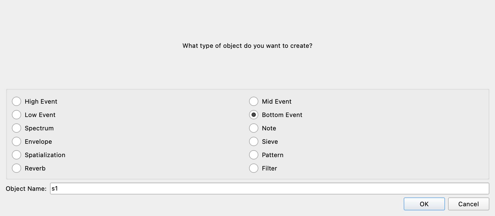

Enter these settings:

| Setting | Value |
| --- | --- |
| Number of Children method | **Fixed** |
| Number of Children To Create | `1` |
| Children Events Definition | **Continuum** |
| Child Start Time | `0` |
| Start Time unit | **Seconds** |
| Child Type | `0` |
| Child Duration | `5` |
| Duration unit | **Seconds** |
| Max Child Duration | `5` |

The first sound starts at `0` and lasts five seconds. Random timing comes after you hear it.

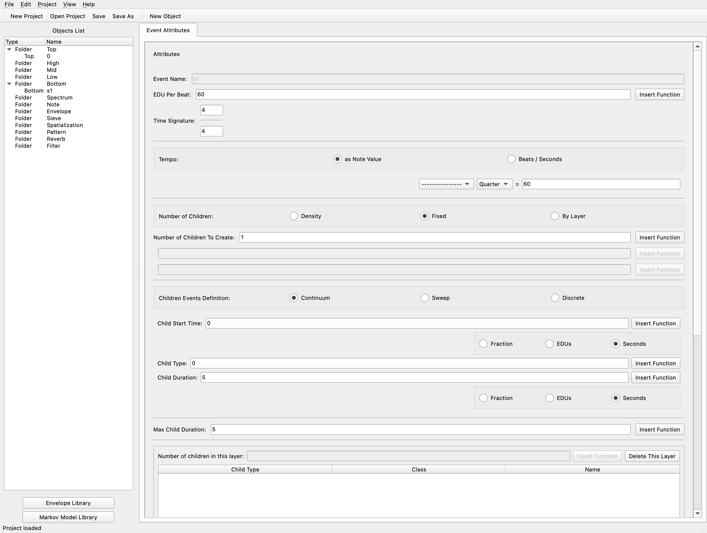

**Setup check:** Bottom s1 shows one child, start `0`, duration `5`, and Seconds for both time units. We still need the sound's envelope, spectrum, and connections before running.

## 7. Draw an amplitude envelope

1. Click **Envelope Library** below Objects List.
2. Click **Create New Envelope**. Select the row numbered **1**.
3. Right-click in the graph and choose **Insert Node**.
4. Click the new middle node; the selected node turns magenta. Replace the text in **X value** with `0.5` and in **Y value** with `1`. Click another field or press **Tab** to finish each entry.
5. Click each endpoint and set **Y value** to `0`. The endpoints' X values stay fixed at `0` and `1`. Each pair in the table is written as `(X, Y)`.

| Point | X value | Y value |
| --- | --- | --- |
| Beginning | `0` | `0` |
| Middle | `0.5` | `1` |
| End | `1` | `0` |

**X** is the position through the sound: 0 is its beginning, 0.5 is halfway, and 1 is its end. **Y** is the value at that position. When this curve controls amplitude, it starts at zero, rises, and returns to zero. For a 5-second sound, the peak occurs at 2.5 seconds.

Type coordinates for exact values. Dragging near the Y = 1 reference line also snaps to `1`; check the result in **Y value**.

Keep both segments **Linear** and **Flexible** for this example. The legend beneath the graph explains the colors and line thicknesses.

Before closing the library, make the curve for the first tone's stereo position:

1. Click **Create New Envelope** again and select **Envelope 2**.
2. Keep its two endpoints. Select the left endpoint and set **Y value** to `1`; do the same for the right endpoint. Their X values stay at `0` and `1`.
3. Keep the segment **Linear** and **Flexible**. The graph should be a horizontal line at Y = 1.
4. Select **Envelope 1** to compare its triangle with the image below. Envelope 2 stays horizontal.
5. Close the library and click **Save**.

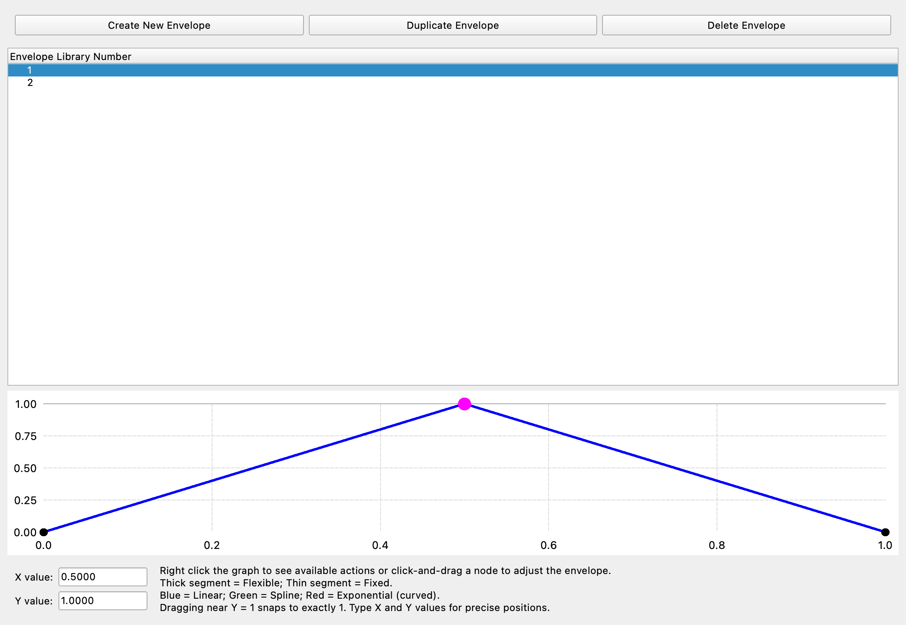

**Setup check:** Envelope 1 is a triangle for amplitude; Envelope 2 is horizontal for stereo position. You will hear them in section 9.

Starting and ending an amplitude envelope at zero helps avoid clicks caused by abrupt waveform changes. It does not by itself prevent clipping when many loud sounds overlap.

## 8. Create Spectrum sp1

1. Select the **Spectrum** folder and click **New Object**.
2. Choose **Spectrum**, enter `sp1`, and click **OK**.
3. Expand Spectrum and double-click **Spectrum sp1**.
4. Set **Number of partials** to `1` and **Deviation** to `0`. Leave **Generate Spectrum** empty.
5. Beside **Partial 1**, click **fn** and choose **EnvLib**.
6. Set **Envelope Number** to `1` and **Scaling Factor** to `1`, then click **OK**.

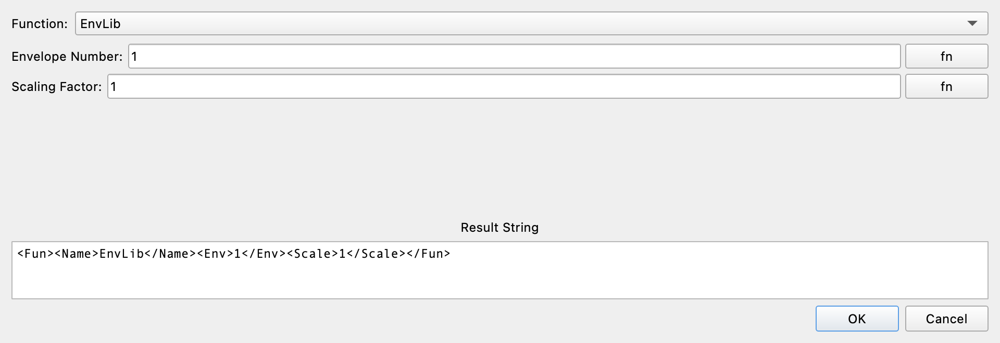

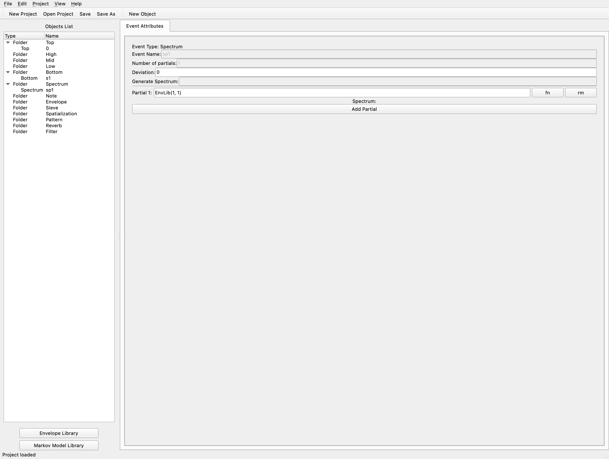

**Scaling Factor** multiplies the envelope's Y values. A factor of `1` keeps the curve unchanged. A factor of `0` makes this partial silent. The single partial gives us a simple tone whose pitch will be set in Bottom s1.

**Setup check:** Spectrum sp1 has one partial row using EnvLib Number `1`, Scale `1`. Connect it to Bottom in section 9.

## 9. Connect and hear your first tone

### Connect Bottom s1 to Spectrum sp1

1. Double-click **Bottom s1** again.
2. Scroll its Event Attributes area until you see the child table headed **Child Type**, **Class**, and **Name**.
3. Drag the **Spectrum sp1 object row** from Objects List into the empty child table. Drag the object, not the Spectrum folder.
4. Check that the table contains **Child Type 0**, **Class Spectrum**, and **Name sp1**.

The left-hand Objects List is a collection of available objects. The right-hand child table is where you connect them.

### Set one fixed pitch and loudness

Scroll farther down in Bottom s1 and enter:

| Setting | Value |
| --- | --- |
| Frequency mode | **Continuum**, then **Hertz** |
| Frequency > Value | `440` |
| Carrier Phase (cycle, 0-1) | `0` |
| Loudness | `45` |
| Filter(Optional) | Leave empty |
| Reverb | Leave empty |
| Modifiers | No rows |

`440` Hz is the pitch A4. The loudness value `45` is an approximate **mf** reference; [section 12](#12-set-loudness) gives the loudness key.

### Keep the sound centered

1. Beside **Spatialization**, click **Insert Function** and choose **SPA**.
2. Select **Stereo** and **Apply To: Sound**.
3. In its envelope row, click **fn** and choose **EnvLib**.
4. Enter **Envelope Number** `2` and **Scaling Factor** `0.5`.
5. Click **OK** in the EnvLib dialog, then **OK** in the SPA dialog.

Envelope 2 stays at 1; multiplying it by 0.5 gives a constant position of 0.5. With the usual left/right channel order, this places the tone in the center. Spatialization needs this complete function even for a stationary sound.

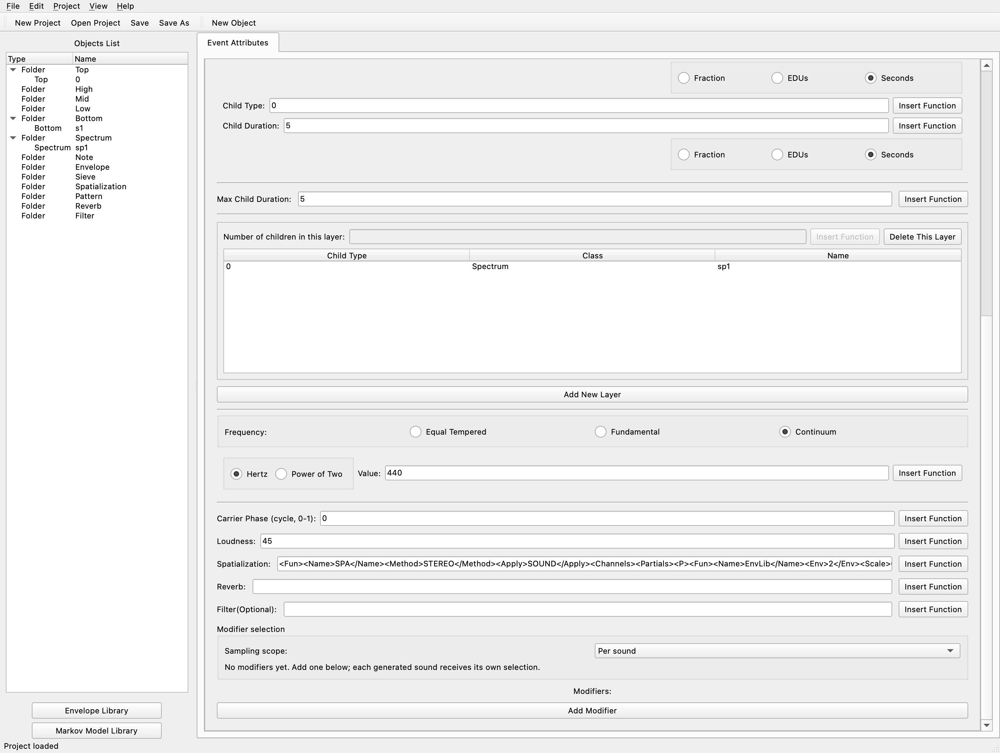

### Connect Top 0 to Bottom s1

Double-click **Top 0**. Drag the **Bottom s1 object row** into Top's child table. Check that it is **Child Type 0**, **Class Bottom**, **Name s1**.

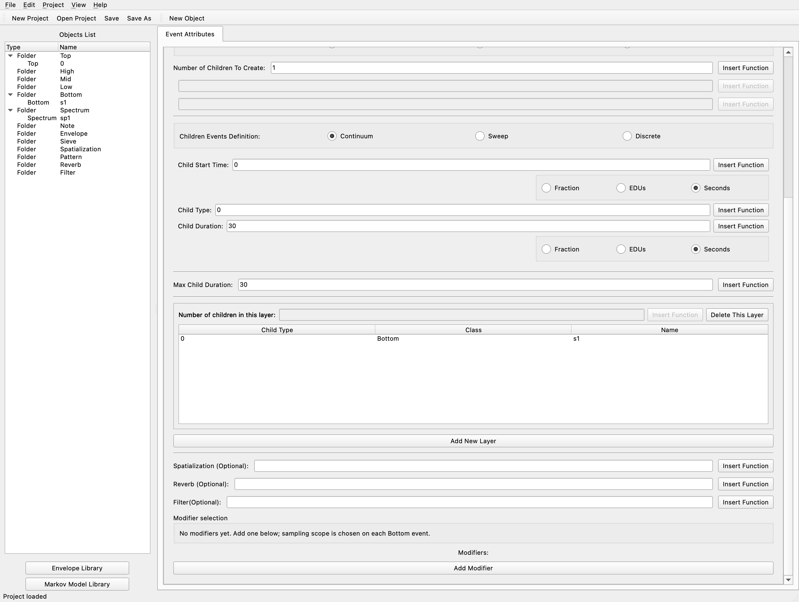

**Ready to Run:** You have connected Top 0 → Bottom s1 → Spectrum sp1. Top creates one Bottom; Bottom creates one five-second sound at time 0. Partial 1 uses Envelope 1 with scale 1. Spatialization uses Envelope 2 with scale 0.5.

### Run and listen

Use this same procedure at every **Listen checkpoint**:

1. Finish the field edit with **Tab** and click **Save**.
2. Choose **Project > Run**.
3. Enter `apple` in **Enter Seed** and click **OK**. A seed controls the sequence of random choices. Keep it the same when comparing versions; changing the seed is a separate experiment.
4. In **Number of runs**, enter `1` and click **OK**.
5. Wait for **Build complete** and exit code `0` in the run window.
6. In Finder or your system's file manager, open the folder containing your `.dissco` file, then **SoundFiles**. Open the newest AIFF in an audio player or sound editor. LASSIE does not automatically play it.

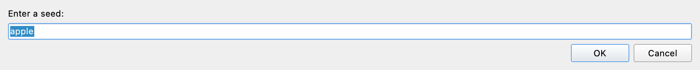

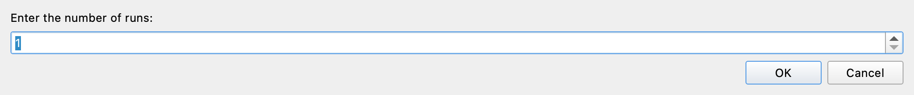

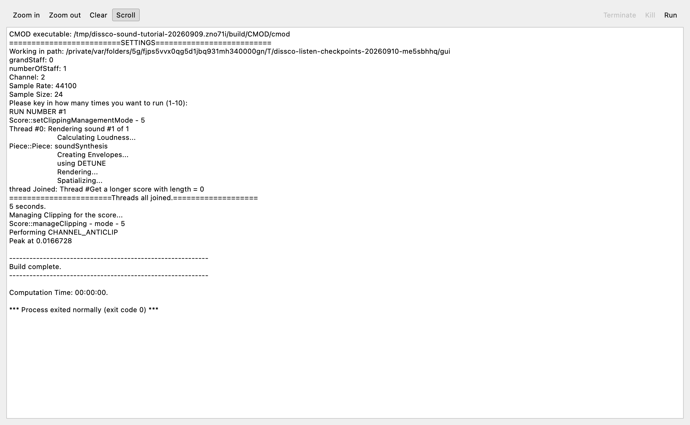

The first output is named `first_tone_0.aiff`; later runs increase the suffix. Output names follow the project filename. Check the modification time to identify the newest result.

**Listen checkpoint 1 — your first tone.** Listen at a comfortable playback volume. One steady pitch should begin fading in immediately, reach its peak halfway through its five-second duration, then fade out. It should stay in the center. If you hear nothing, check Bottom's count `1`, start `0`, the two child-table connections, and the two EnvLib references in the Ready to Run paragraph. If no file appears, use [No audio file appears](#no-audio-file-appears). Do not add more settings until this tone works.

Click **Save** to keep your completed `first_tone.dissco`. Keep this file and its audio as your starting point for later experiments. If it stops working, the supplied [first_tone.dissco](examples/tutorial_sound/first_tone.dissco) is a recovery point.

### Compare two versions

Before changing a working setup, Run it and note its AIFF filename. Then make the change and Run again. Compare the files at the same player volume, with automatic volume leveling disabled. If a checkpoint asks for two `.particel` reports, copy the first to `before.particel` before the next Run overwrites it.

Keep seed `apple` for comparisons. A seed repeats choices within the same setup; adding a random function can change later choices elsewhere. The effect exercises therefore use fixed timing and pitch.

## 10. Turn one tone into a short piece

1. With your completed first tone open, choose **File > Save As**. Create or select a separate folder and save as `tutorial_sound.dissco`. Unlike New Project, Save As writes directly into the selected folder.
2. In **Project > Set Properties**, change **Project Title** to `tutorial_sound`, accept, and Save.

You are now editing the copy; `first_tone.dissco` stays unchanged. The checkpoints below build on each other. Use [Run and listen](#run-and-listen) each time.

### Hear a pitch change

Keep **Continuum > Hertz** selected. In Bottom s1, replace Frequency Value `440` with `880`.

**Listen checkpoint 2 — one octave higher.** Run and compare with checkpoint 1. You should hear the same five-second fade and centered position, at a higher pitch. If the pitch does not change, check that Hertz is selected and that you opened the newest file. Restore Value to `440` before the next exercise; checkpoint 1 already provides its centered comparison audio.

### Hear stereo movement

Open Bottom's **Spatialization** function. Keep **Stereo** and **Apply To: Sound**. In the existing EnvLib row, change **Envelope Number** from `2` to `1` and **Scaling Factor** from `0.5` to `1`. Accept both dialogs.

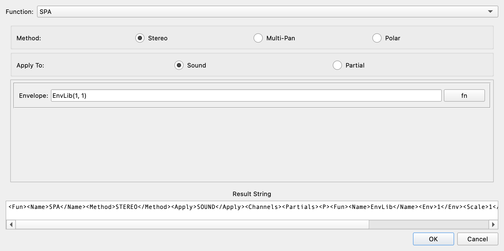

With the usual channel order, position `0` is left, `0.5` is center, and `1` is right. Here the triangle controls position: its Y = 0 means left, not silent. Partial 1 still uses that same triangle separately for amplitude.

**Listen checkpoint 3 — left, right, left.** Run. On headphones or two speakers, the tone should move toward the right as it grows, then back toward the left as it fades. The very ends are quiet because the amplitude also reaches zero. If it stays centered, check EnvLib Number `1`, Scale `1`, and that playback is stereo rather than mono. You can continue with a mono playback device, but it cannot demonstrate the left/right movement.

### Hear a room tail

1. Beside **Reverb**, click **Insert Function** and choose **REV_Simple**.
2. Select **Apply To: Sound** and set **Room Size** to `0.5`.
3. Click **OK**.

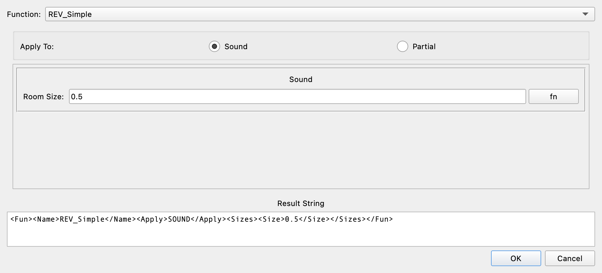

**Listen checkpoint 4 — the sound lingers.** Run and compare the end with checkpoint 3. Reverberation adds a fading tail after the original tone, like reflections in a room. If the change is unclear, compare the final seconds of both files and check Room Size `0.5` and Apply To Sound. Keep this reverb for the rest of section 10.

### Make five sounds with random starting times

1. In Bottom s1, beside **Child Start Time**, click **Insert Function** and select **Random**.
2. Set **Lower Bound** to `0` and **Upper Bound** to `25`, then click **OK**.
3. Keep **Continuum** for Children Events Definition and **Seconds** for start and duration.
4. Change **Number of Children To Create** from `1` to `5`. Keep Child Type `0`, Child Duration `5`, and Max Child Duration `5`.

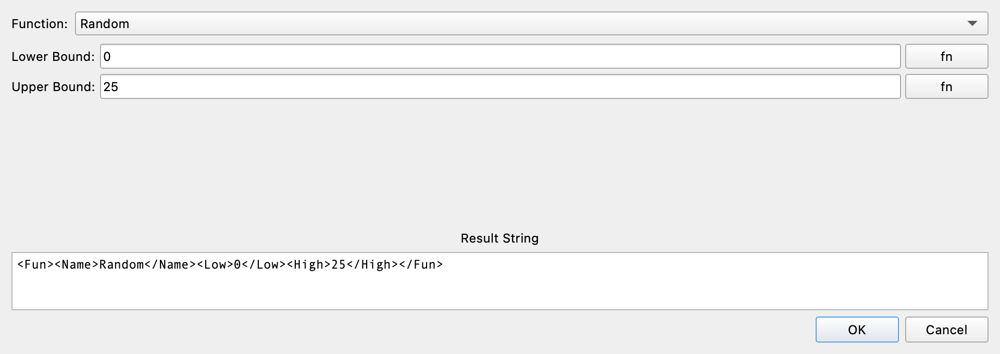

Set the random start function before increasing the count. Otherwise, five children with start `0` would begin together. A start at second 25 plus a five-second duration fits within the 30-second Bottom event.

**Listen checkpoint 5 — one tone becomes a texture.** Run. The engine now creates five tones at the same 440 Hz pitch with varied starting times. They can overlap, so you may hear blended swells rather than five separate attacks. There can now be silence before the first tone. If you need to verify the count, open the generated `.particel` text report beside the project (for example, `tutorial_sound.particel`) and check its five `+-Sound` entries. If all attacks coincide, reopen Child Start Time and check the Random bounds.

### Give the sounds different pitches

1. In Bottom's **Frequency**, select **Equal Tempered**.
2. Beside its **Value** field, click **Insert Function** and select **RandomInt**.
3. Set **Lower Bound** to `48` and **Upper Bound** to `72`, then click **OK**.

DISSCO counts equal-tempered semitones from C0: `48` is C4, `60` is C5, and `72` is C6. RandomInt chooses a whole-number pitch in that range. These are DISSCO pitch numbers; MIDI note numbers for the same pitches are 12 higher.

**Listen checkpoint 6 — your first short piece.** Run. You should now hear varied pitches, five fading tones that may overlap, stereo movement, and a room tail. If the pitches remain fixed, check Equal Tempered and reopen its RandomInt function. Random choices can repeat a pitch; five different pitches are not guaranteed. Adding pitch randomness can also change the later start-time draws, so this comparison demonstrates pitch variety rather than identical timing.

**Piece Duration** defines the parent event's time span. The rendered file can end earlier when the last sound finishes, or extend beyond a sound's nominal end because of reverberation. Do not use an exact 30-second file length as the only success check.

Save, close, and reopen `tutorial_sound.dissco`, then Run again to check that it still works. **Your first piece is complete.** Later sections are optional experiments.

### Prepare for the later experiments

**Start each numbered section from a fresh copy**, so an earlier effect cannot confuse the next comparison. Open the starting file, then use **File > Save As** to save under a new name in a separate folder.

| Sections | Starting project | State you should see |
| --- | --- | --- |
| 11–19 and 23 | [first_tone.dissco](examples/tutorial_sound/first_tone.dissco) | One 440 Hz tone, one partial, centered, no reverb or modifiers |
| 20–22 | [tutorial_sound.dissco](examples/tutorial_sound/tutorial_sound.dissco) | Five tones, random timing and pitch, stereo movement, reverb |

Section 22 starts each example from a fresh copy and supplies a shared timing setup. An exercise requiring **three partials** uses the [three-row spectrum](#add-and-remove-partials) with Generate Spectrum empty.

A library edit, phase change, or file operation may need a visible check as well as listening. An inaudible difference alone does not establish failure.

## 11. Change pitch and carrier phase

**Start:** a fresh first-tone copy. **Work in:** Bottom s1 > Frequency.

There are **three main modes**. Only the selected mode's fields are used. Continuum has two input options of its own.

| Main mode | Input | Example |
| --- | --- | --- |
| **Equal Tempered** | Whole-number semitones above C0 | `48` = C4, about 261.63 Hz. Add `12` for one octave. |
| **Fundamental** | Fundamental Frequency in Hz × positive integer Partial Number | `220` × `2` gives a base pitch of 440 Hz. |
| **Continuum** | Value interpreted as Hertz or Power of Two; decimals are allowed | See the two options below. |

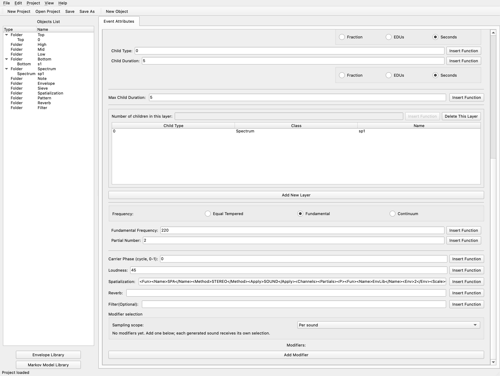

### Choose an input option within Continuum

| Option | Meaning of Value | Examples |
| --- | --- | --- |
| **Hertz** | Frequency in cycles per second | `440` = A4; `442.5` is slightly higher. |
| **Power of Two** | Octaves above C0; an increase of `1` doubles frequency | `4` = C4; `4.5` is six semitones above C4; `4.75` ≈ A4; `5` = C5. |

Power of Two uses approximately `16.3516 × 2^Value` Hz. Equal Tempered counts semitones instead: `48` semitones and `4` octaves both give C4.

**Listen checkpoint — two inputs, the same pitch.** Run with **Continuum > Hertz = 440**. Select **Power of Two**, replace Value with `4.75`, and Run again. Both should sound approximately the same. **Switching the option does not convert the existing number**, so leaving `440` in Power of Two would be wrong. Restore **Hertz = 440**. The octave comparison with Hertz `880` is in section 10.

Fundamental's **Partial Number** sets the sound's base pitch. Spectrum's **Number of partials** sets how many components the sound contains; these are separate controls.

**Carrier Phase (cycle, 0-1)** sets the oscillator's initial position: `0` = 0°, `0.25` = 90°, `0.5` = 180°, and `1` = 360°. Leave it at `0` initially. Its effect can be inaudible in an isolated sine tone and more apparent when signals combine. For phase that changes during a sound, use **PHASE_MOD** in section 18.

## 12. Set loudness

**Loudness** is entered in **sones**, a measure of perceived loudness. It is not a percentage, a MIDI velocity, or a decibel reading.

### Loudness key — approximate values

These are **approximate reference values**. The dynamic marking is a musical shorthand for a loudness level. Enter only the number in Bottom s1's Loudness field, for example `45` for **mf**.

| Dynamic marking | Approximate loudness in sones | Description |
| --- | --- | --- |
| **ppp** | **= 8** | Very, very soft |
| **pp** | **= 16** | Very soft |
| **p** | **= 32** | Soft |
| **mf** | **= 45** | Moderately loud |
| **f** | **= 64** | Loud |
| **ff** | **= 128** | Very loud |
| **fff** | **= 256** | Very, very loud |

To vary loudness across sounds, insert **Random**, for example with bounds `32` and `64`. For the comparison below, enter plain numbers.

Loudness sets the intended overall level; an amplitude envelope shapes its fade. Actual playback level also depends on the spectrum, overlapping sounds, processing, and playback equipment.

**Listen checkpoint — softer and louder.** In your first-tone copy, set Bottom Loudness to `32` and run. Change only Loudness to `64` and run again. At the same playback volume, the second should be stronger. If the difference is unclear, check the newest filenames, disable player volume leveling, and confirm that you changed Loudness rather than an envelope scale. Restore `45`.

## 13. Work with envelopes

### Edit, duplicate, and reuse library curves

**Start:** a fresh first-tone copy. In **Envelope Library**, select a curve, then a node. Type **X value** and **Y value** for exact coordinates, or drag the node. Right-click to insert/remove interior nodes or change segment behavior.

**Listen checkpoint — change the fade.** Run the original tone first. Duplicate Envelope 1 with **Duplicate Envelope**. Select the new row and note its number. Change the middle node from `(0.5, 1)` to `(0.2, 1)`. In **Spectrum sp1 > Partial 1**, point EnvLib to that number, Scale `1`, and Run. The peak should arrive about one second into the five-second tone, followed by a longer fade. If unchanged, check Partial 1's envelope number. Restore that reference to Envelope `1` afterward.

**Optional coordinate check:** select the duplicate, which is now unused, and type middle-node Y `2.5`. Save, reopen, and select it again; the node should remain accessible. Change Y to `1` to finish. This keeps the original amplitude curve intact.

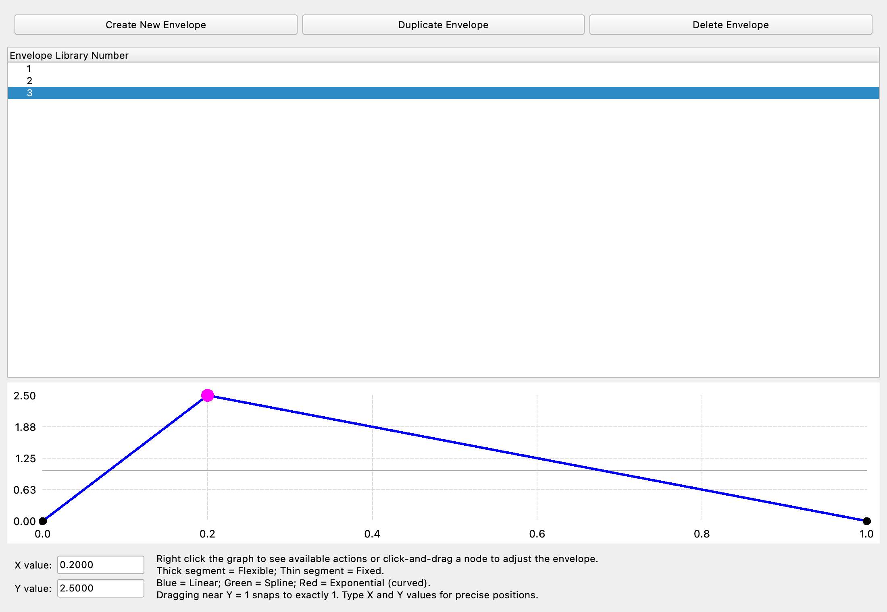

The graph expands to include all nodes, including endpoints, and holds its scale steady during a drag. The Y editor accepts `0`–`10`; an EnvLib Scaling Factor can supply larger parameter values.

| Segment choice | Behavior and graph appearance |
| --- | --- |
| **Linear** | Straight interpolation; blue. |
| **Spline** | Spline interpolation in the rendered sound. The current green graph preview is straight, so it does not display the rendered curvature. |
| **Exponential** | J-shaped rise or L-shaped fall; red. |
| **Flexible** | Stretches to fit the sound/event; thick line. |
| **Fixed** | Preserves the specified length where possible; thin line. Leave enough total duration for fixed segments. |

The envelope-list menu also provides **Copy Envelope** and **Paste Envelope**. A library edit affects every field referencing that number: in the completed five-tone project, Envelope 1 controls both amplitude and position. Duplicate a curve and change one field's reference to vary only that use. Before deleting a curve, check references and subsequent curve numbers.

### Make a constant envelope for effect parameters

Both supplied projects already contain **Envelope 2**, a horizontal line from `(0, 1)` to `(1, 1)`, Linear and Flexible. To create it in another project, click **Create New Envelope**, set both endpoint Y values to `1`, and note its actual number.

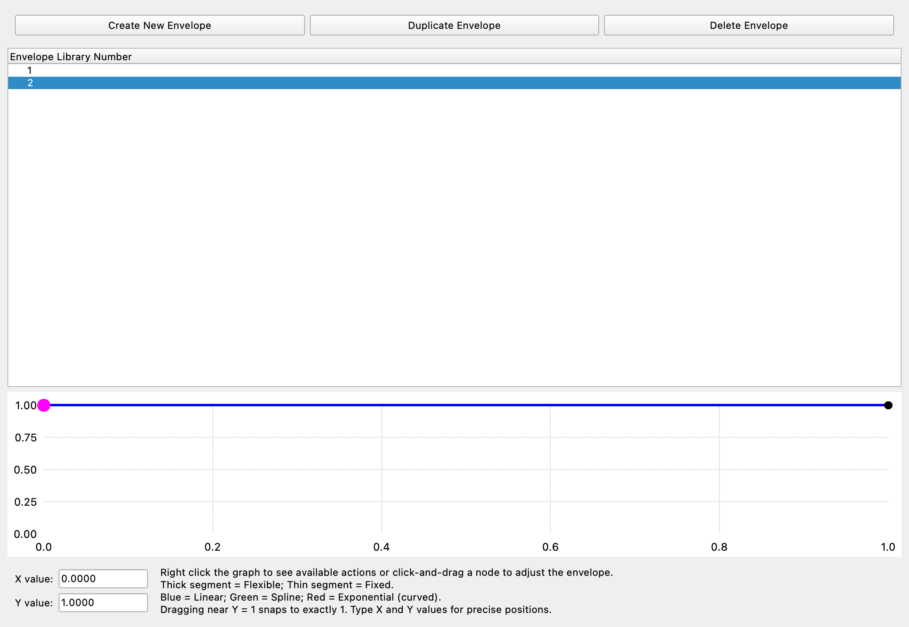

When an exercise says **constant envelope `5`**, it means a curve whose *value* stays at 5, not library entry 5:

1. Beside that parameter, click **Insert Function** or **fn**, then choose **EnvLib**.
2. Set **Envelope Number** to `2` (or your flat curve's actual number).
3. Set **Scaling Factor** to the required value and click **OK**.

For example, section 16's **Reverb Percentage** uses Scale `0.25`; section 18's **TREMOLO Rate** uses Scale `5` for 5 Hz. Reuse the same flat curve; do not change its stored Y values for each effect.

### Build a curve inside a field with MakeEnvelope

**MakeEnvelope** stores a curve inside one field without editing Envelope Library. Use it for a curve needed once or for nodes whose coordinates use functions.

**Reference for the GLISSANDO exercise in [section 18](#18-add-sound-modifiers):** after adding GLISSANDO, open **Parameters > Magnitude** and choose **Insert Function > MakeEnvelope**. Enter two nodes `(0, 0.5)` and `(1, 1)`, **Linear**, **Flexible**, Scaling Factor `1`. Accept MakeEnvelope, then the modifier dialog. These are frequency multipliers: the sound starts an octave below its base pitch and rises to it.

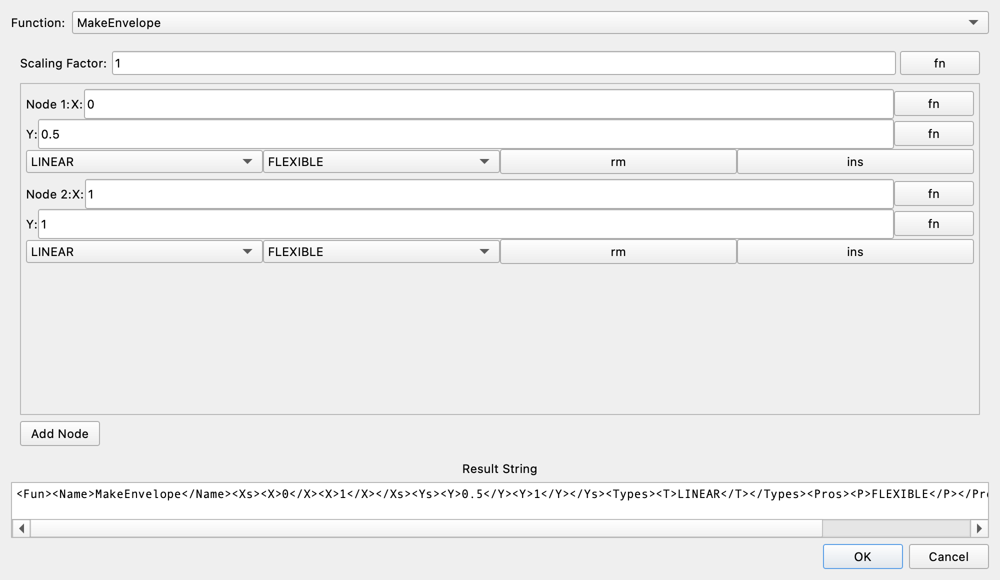

Each row is a node. **Add Node**, **ins**, and **rm** add, insert, and remove rows. Keep X values increasing; interpolation and length behavior apply to the segment leaving a node. The last node has no outgoing segment.

Always check the receiving field's units: the same curve can describe amplitude, position, probability, or a rate.

## 14. Build richer spectra

### Add and remove partials

Run the first-tone copy before adding partials. Keep Bottom s1's frequency at **Continuum > Hertz = 440**. Open **Spectrum sp1**, keep **Deviation = 0**, and clear **Generate Spectrum** if it contains a function. Starting from the first-tone project's one partial, click **Add Partial** twice so that you have three rows. In each row, click **fn**, choose **EnvLib**, and enter the following Envelope Number and Scaling Factor:

| Partial | EnvLib Envelope Number | Scaling Factor | Frequency when the base is 440 Hz and Deviation is 0 |
| --- | --- | --- | --- |
| 1 | `1` | `1` | 440 Hz |
| 2 | `1` | `0.5` | 880 Hz |
| 3 | `1` | `0.25` | 1320 Hz |

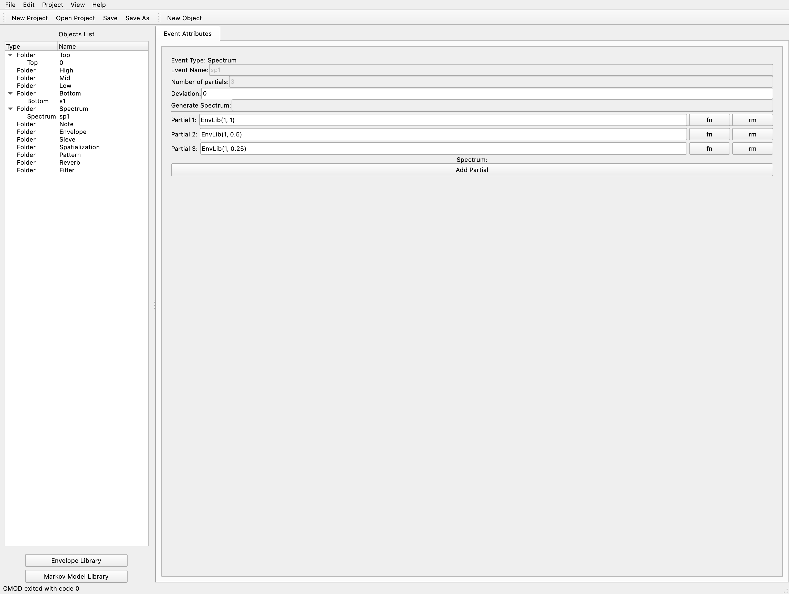

**Listen checkpoint — a richer tone.** Run the three-partial version and compare it with the one-partial version at the same 440 Hz base frequency. The added frequencies change the tone color; listen for a less pure tone rather than three separate notes. If it still sounds like one sine wave, check that Number of partials is `3`, all three EnvLib rows are filled, and Generate Spectrum is empty. Give a partial a different envelope to make that component enter or fade at a different time.

The row controls let you insert or remove partials. For ordinary numeric counts, LASSIE updates **Number of partials** when the list changes. You can also use an expression for the count; in that case, make sure the spectrum contains enough envelope rows for every count the expression can produce. Do not increase the count and leave required partial rows blank.

**Deviation = 0** keeps the partials at whole-number multiples of the base frequency. A small positive value, such as `0.02`, introduces random frequency offsets in the upper partials. Try small changes and compare using the same seed. The first partial remains the fundamental.

### Generate Spectrum

**Generate Spectrum** offers another way to create partials:

1. Beside that field, click **fn** and choose **Generate_Spectrum**.
2. For **Envelope**, insert **EnvLib**, Envelope Number `1`, Scaling Factor `1`.
3. Set **Distance** to `1` and click **OK**.
4. For an initial comparison, use a Bottom frequency of **Continuum > Hertz = 440**.

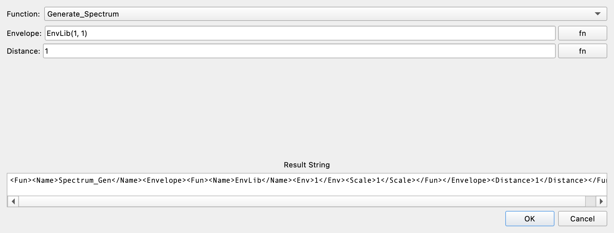

The current generator creates **20 harmonic partials** using the supplied envelope. While this function is present, it supplies the partials in place of the explicit partial-envelope list. Its reference frequency range is 233–932 Hz; values outside that range produce a warning.

**Current limitation:** Distance is present in the dialog but does not currently change the generated spectrum. Use explicit partial rows when you need individual levels or precise control of the number of partials. Clear **Generate Spectrum** to return to those rows.

**Listen checkpoint — generated spectrum.** Run with Generate Spectrum filled, then clear that field and run to return to your explicit partial rows. Compare tone color. If changing the row scales seems to have no effect, check that Generate Spectrum is empty. Its Distance control currently has no audible effect, so do not use Distance as a success test.

## 15. Place sounds in space

Double-click **Bottom s1**, find **Spatialization**, click **Insert Function**, and choose **SPA**. Have the constant Envelope 2 from [section 13](#make-a-constant-envelope-for-effect-parameters) ready. Choose **Method** and **Apply To** before entering envelopes: changing either option clears and rebuilds the rows.

### Stereo

For two channels, use an envelope in the 0–1 range. With the usual channel order, `0` is left, `0.5` is centered, and `1` is right.

**Listen checkpoint — position.** Choose **Apply To: Sound**, insert EnvLib Envelope `2`, and set its scale to `0.5`. Run this centered version. Change only the scale to `0`, run and listen for the left speaker, then use `1` and run for the right. If all three sound the same, check stereo playback and the EnvLib scale. Restore `0.5`. For movement, use Envelope `1`, scale `1`, as in section 10.

### Multi-Pan

Select **Multi-Pan** and **Apply To: Sound** to enter a separate level envelope for each output channel. Click **Insert Channel After** to add Channel 2; **Remove This Channel** removes a channel group. Match the number of groups to **Project Properties > Number of Channels**.

**Listen checkpoint — channel balance.** For a two-channel example, give both channel rows EnvLib Envelope `2`, Scaling Factor `0.5`, and run. Then change the **Scaling Factor** in Channel 1's EnvLib to `0.8` and Channel 2's to `0.2`, and run again. The balance should shift toward the first channel. If it does not, check both channel groups and their EnvLib scales. For more than two channels, you also need a player, audio interface, and speaker arrangement that supports the chosen channel count.

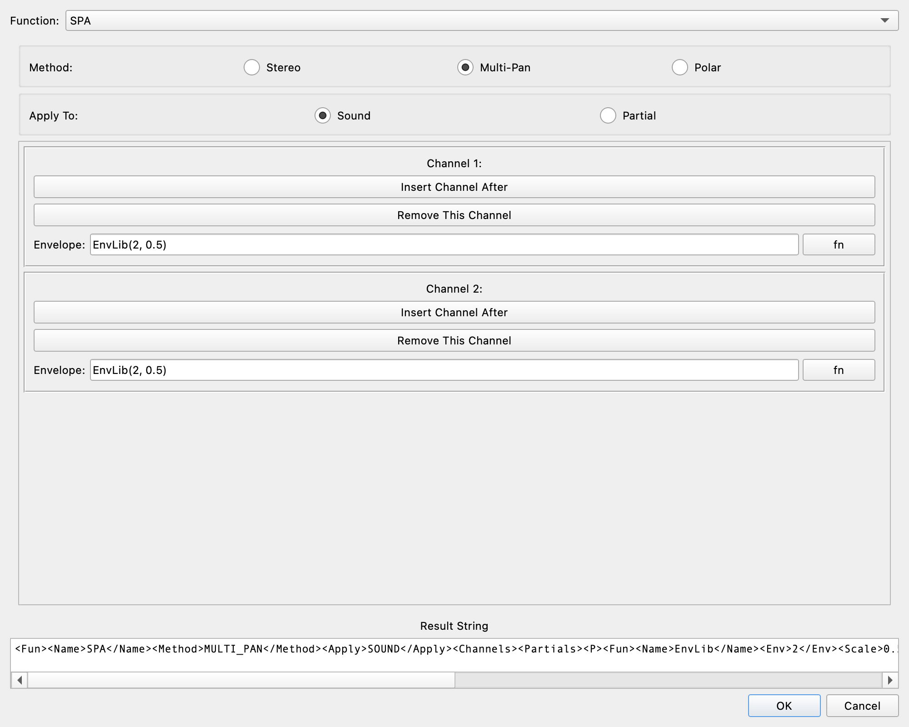

### Polar

Select **Polar** and **Apply To: Sound** to describe a position around a circular speaker arrangement with **Theta** and **Radius** envelopes.

- **Theta** is an angle measured in multiples of π in this interface: `0.5` means π/2 radians, or 90°. A change of `2` represents a complete turn.
- **Radius** is the distance from the center of the speaker circle in the spatializer's normalized coordinates. Start with a constant `0.5`.

For an initial configuration, give Theta a constant envelope of `0` and Radius a constant envelope of `0.5`. A moving Theta envelope creates motion around the arrangement. Speaker count and channel order must match your playback setup; two speakers cannot reproduce every aspect of a surrounding array.

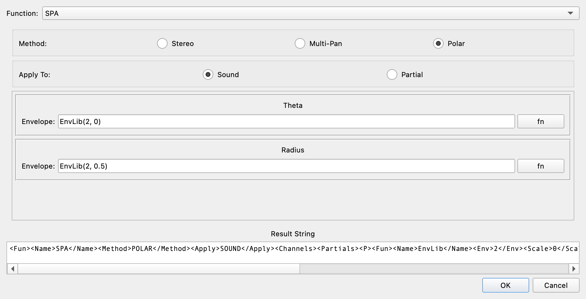

**Run and check — Polar.** With both Theta and Radius filled, save and run. Confirm that a new file is produced with the project's channel count. Assess direction using the intended speaker arrangement; hearing a complete circle is not an appropriate pass/fail test on two speakers. If the run reports a missing envelope, reopen Polar and check both rows.

### Sound versus Partial

**Sound** gives the whole sound one spatial behavior. **Partial** lets its frequency components occupy different positions. Prepare the [three-partial spectrum](#add-and-remove-partials), then choose **Stereo** and **Apply To: Partial**. Use the row's **ins** control until there are three partial rows. Fill all three with EnvLib Envelope `2`, Scale `0.5`, accept the dialog, and run this centered version. Reopen it, change only Partial 1's scale to `0`, accept, and run again.

**Listen checkpoint — one component moves.** Compare the two versions: the fundamental moves left while the upper components stay centered. This can be subtler than moving the whole sound. If every component moves together, check **Apply To: Partial** and that only the first row uses scale `0`.

For Multi-Pan Partial mode, fill one envelope per partial in every channel group. For Polar Partial mode, fill one per partial in both Theta and Radius. The row numbers match Spectrum's partial order. Changing to Partial mode does not automatically copy your Sound-mode values into the new rows.

## 16. Add reverberation

Run a fresh first-tone copy with **Bottom s1 > Reverb** empty and keep its audio. This is the **dry** signal; **wet** means the reverberated signal. Then click **Insert Function** beside Reverb and choose a model before filling its parameters. Reverb Percentage blends dry and wet.

| Function | Controls | When to use it |
| --- | --- | --- |
| **REV_Simple** | Room Size | A quick room effect; begin with `0.5`. |
| **REV_Medium** | Reverb Percentage envelope, Hi/Low Spread, Gain All Pass, Delay | Control the wet/dry balance and the character of the decay. |
| **REV_Advanced** | Reverb Percentage envelope, Comb Gain List, LP Gain List, Gain All Pass, Delay | Set the individual gains of the reverberator's filter bank. |

### Try REV_Medium

Select **REV_Medium**, choose **Apply To: Sound**, and enter the following values. For Reverb Percentage, use EnvLib Envelope `2` with the listed Scaling Factor; enter the other three values directly as numbers.

| Field | Value |
| --- | --- |
| Reverb Percentage | Constant envelope `0.25` |
| Hi/Low Spread | `0.5` |
| Gain All Pass | `0.7` |
| Delay | `0.05` seconds |

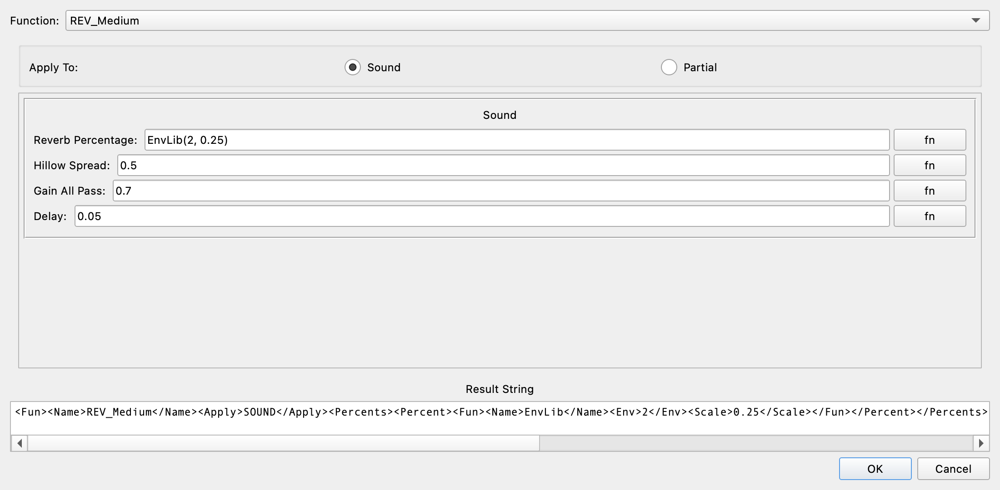

Here a Reverb Percentage envelope of `0.25` means a quarter wet signal, not the number 25. **Hi/Low Spread** changes the relationship between high- and low-frequency decay. **Gain All Pass** and **Delay** affect the reverberator's internal echoes and diffusion. Compare small changes individually.

**Listen checkpoint — Medium reverb.** Run these settings and compare the end with the dry file. Listen for the added tail. If it is missing, check that Delay is `0.05` rather than `0` and that Reverb Percentage uses Envelope `2`, Scale `0.25`.

### Try REV_Advanced

Select **REV_Advanced** and **Apply To: Sound**. Use EnvLib for Reverb Percentage, type each gain list in its single list field, and enter Gain All Pass and Delay as numbers:

| Field | Value |
| --- | --- |
| Reverb Percentage | Constant envelope `0.25` |
| Comb Gain List | `0.6, 0.6, 0.6, 0.6, 0.6, 0.6` |
| LP Gain List | `0.2, 0.2, 0.2, 0.2, 0.2, 0.2` |
| Gain All Pass | `0.7` |
| Delay | `0.05` seconds |

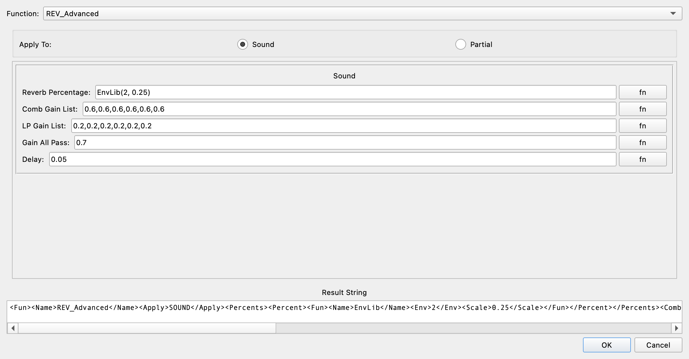

Each gain list must contain **exactly six** values. Keep these modest values while learning; large feedback gains can create excessive or unstable tails. A Delay of `0` disables the Medium or Advanced effect.

**Listen checkpoint — Advanced reverb.** Run with the complete settings above and compare with the dry file again. Listen for lingering reflections; this model need not sound longer than Medium. If Run fails, check that both gain lists contain six numbers and that every parameter group is complete.

All three models offer **Sound** and **Partial** application. In Partial mode, each numbered parameter group corresponds to a spectrum partial; for a three-partial spectrum, provide three complete groups. Start by using the same settings in all three, then change one group to hear the difference. Adding separate reverbs to many partials increases rendering work. Changing the application mode clears and rebuilds its groups, so enter the values after choosing the mode.

To remove a local reverb, clear the Reverb field. If an ancestor event supplies reverb, check that setting too; it may still be inherited.

## 17. Shape the tone with filters

A filter boosts, reduces, or removes parts of the frequency range. For this comparison, use the [three-partial spectrum at a 440 Hz base frequency](#add-and-remove-partials), with Generate Spectrum empty. Its partials lie at 440, 880, and 1320 Hz, so the low-pass example can reduce the upper partial. You can also try the [white-noise example](#wave-type) after learning modifiers.

1. In **Bottom s1**, find **Filter(Optional)**.
2. Click **Insert Function** and choose **MakeFilter**.
3. Start with **LPF**, **Frequency** `1000`, and **Band Width** `1`.
4. Click **OK**.

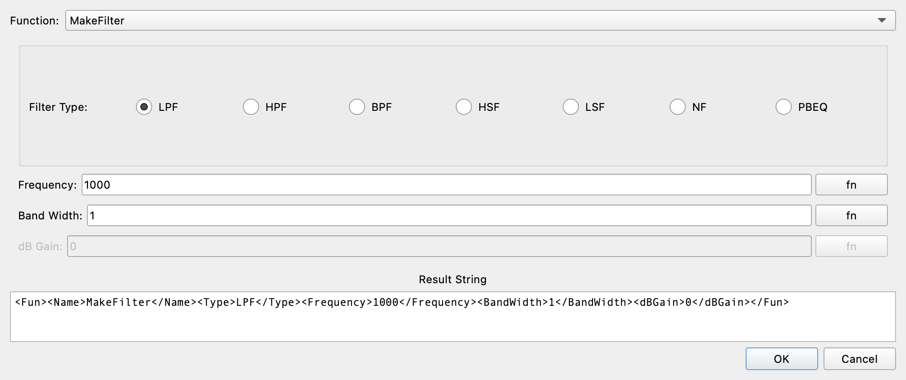

| Button | Full name | Effect |
| --- | --- | --- |
| **LPF** | Low-pass filter | Reduces frequencies above the cutoff; often makes a sound darker. |
| **HPF** | High-pass filter | Reduces frequencies below the cutoff. |
| **BPF** | Band-pass filter | Retains a band around the selected frequency. |
| **NF** | Notch filter | Reduces a band around the selected frequency. |
| **LSF** | Low-shelf filter | Boosts or cuts the lower frequency region. |
| **HSF** | High-shelf filter | Boosts or cuts the upper frequency region. |
| **PBEQ** | Peaking band equalizer | Boosts or cuts a band around the selected frequency. |

**Frequency** is in Hz. **Band Width** is in octaves, rather than Hz. **dB Gain** is used for the shelving filters and PBEQ; negative values cut and positive values boost. It is disabled for filter types that do not use it. Try `-6` dB with LSF, HSF, or PBEQ.

Keep the frequency positive and below half the project's sample rate. At 44100 Hz, that upper limit is 22050 Hz. Clear **Filter(Optional)** to remove the local filter, and check ancestor filters if filtering remains.

**Listen checkpoint — hear the filter.** Run the three-partial version with LPF at `1000`, then clear Filter(Optional) and run the unfiltered version. The filtered sound should have less upper-frequency content. If the difference is small, check that the spectrum really has the 880 and 1320 Hz partials; filtering the original 440 Hz sine alone gives a weaker demonstration. Keep the two files and compare tone color at the same playback volume.

## 18. Add sound modifiers

**Start:** a fresh first-tone copy for **each modifier** below. This prevents one test's partials or effects carrying into another. DETUNE additionally needs the [three-partial spectrum](#add-and-remove-partials).

1. Open **Bottom s1 > Modifiers**, click **Add Modifier**, and choose a type.
2. Open **Parameters...** and select **Apply to: SOUND**.
3. Fill the required parameters from the table. For each constant envelope, choose **Insert Function > EnvLib**, Number `2`, Scale equal to the listed value. GLISSANDO uses MakeEnvelope; DETUNE takes plain numbers.
4. Accept the Parameters dialog. Use the checkpoint below to compare the effect OFF and ON.

| Modifier | What to listen for | Starting SOUND parameters |
| --- | --- | --- |
| **TREMOLO** | Repeating loudness pulses | Magnitude envelope `0.3`; Rate envelope `5` Hz. |
| **VIBRATO** | Repeating pitch wavering | Magnitude envelope `0.01`; Rate envelope `5` Hz. |
| **GLISSANDO** | A rise from 220 to 440 Hz | Magnitude: MakeEnvelope `(0, 0.5)` to `(1, 1)`, Linear, Flexible, Scale `1`. |
| **DETUNE** | Upper partials move away from harmonic tuning | Spread `0.02`; Direction `-1`; Velocity `0.5`. Use three partials. |
| **PHASE_MOD** | A change in tone color from varying oscillator phase | Magnitude envelope `0.1` cycle; Rate envelope `5` Hz. |
| **AMPTRANS** | Brief irregular amplitude changes | Magnitude envelope `0.1`; Rate envelope `0.25`; Width envelope `1103` samples. |
| **FREQTRANS** | Brief irregular pitch changes | Magnitude envelope `0.01`; Rate envelope `0.25`; Width envelope `1103` samples. |
| **WAVE_TYPE** | White noise replacing the sine tone | Magnitude envelope `1` for noise; `0` for sine. |

**Listen checkpoint — effect OFF and ON.** Set **Default ON chance** to `0%` and Run. Change only that chance to `100%` and Run again. Compare using the table's listening goal. Begin with TREMOLO, VIBRATO, or WAVE_TYPE for clear contrasts; phase, detune, and transient changes can be subtler. If unchanged, check SOUND and every required parameter. Start the next modifier from a fresh first-tone copy, not from the DETUNE spectrum.

### Tremolo, vibrato, and phase modulation

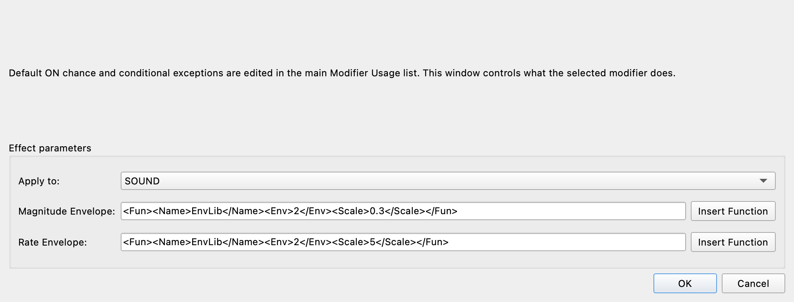

Tremolo magnitude `0` gives no modulation. Vibrato magnitude is relative frequency depth: `0.01` is about 1%. A Rate of `5` means five modulation cycles per second.

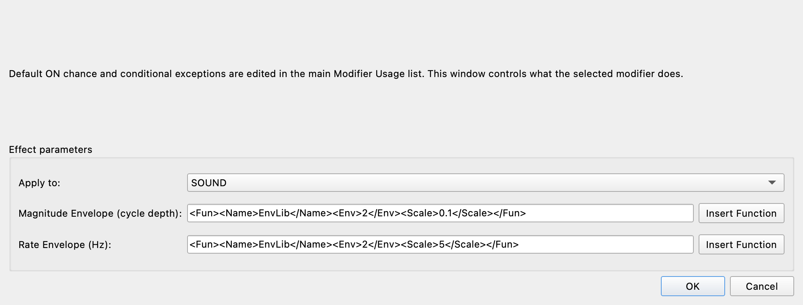

PHASE_MOD magnitude is in **cycles**, not degrees or frequency ratios. It is independent of the fixed Carrier Phase setting.

### Glissando and detune

GLISSANDO multiplies frequency: `1` preserves pitch, `2` doubles it, and `0.5` halves it. Keep the envelope positive; the amplitude triangle's zero endpoints are unsuitable here. See the [MakeEnvelope steps](#build-a-curve-inside-a-field-with-makeenvelope).

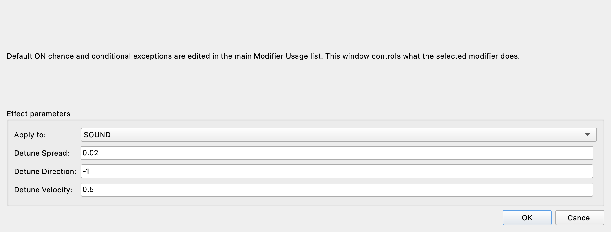

SOUND DETUNE uses numeric **Spread** from 0 to 1, nonzero **Direction**, and **Velocity** from -1 to 1. Negative Direction moves toward detuning; positive moves toward tuning. Velocity controls that motion. These fields do not take envelopes.

### Transients

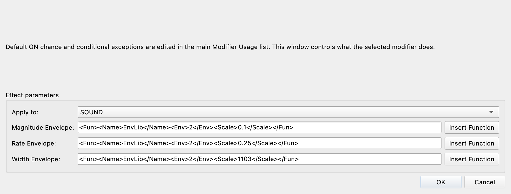

For AMPTRANS and FREQTRANS, **Rate** is a probability per check from `0` to `1`, not Hz. **Width** is a positive number of audio samples: `1103` is about 25 milliseconds at 44100 Hz. The example produces irregular disturbances, not a regular oscillation.

### Wave type

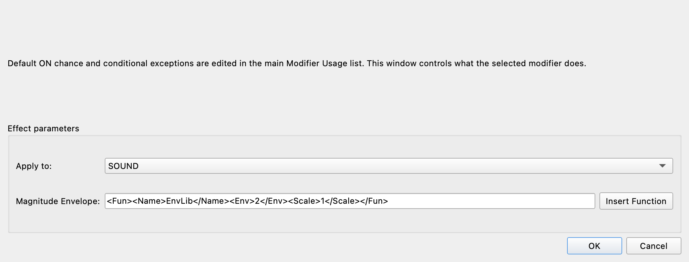

Use a constant envelope for WAVE_TYPE. A sloping envelope does not smoothly blend sine and noise. Combine noise with **MakeFilter** to restrict its frequency range.

To disable any modifier, use its remove control or set Default ON chance to `0%`. Fill required parameters even for an OFF/ON comparison.

## 19. Apply modifiers to individual partials

**SOUND** applies the effect's parameters across the sound's partials. **PARTIAL** lets each partial have different values or receive no effect at all.

1. Use the [three-partial spectrum](#add-and-remove-partials), keep Generate Spectrum empty, and prepare [constant Envelope 2](#make-a-constant-envelope-for-effect-parameters).
2. Remove any other modifiers for this comparison. Add **TREMOLO**, set **Default ON chance = 100%**, leave it with **No exceptions**, and open **Parameters...**.
3. Change **Apply to** to **PARTIAL**.
4. Click **Customize...** beside **Partial Parameters**.
5. In the first partial row, set **Probability** to a constant envelope of `1`, **Magnitude** to a constant envelope of `0.3`, and **Rate** to a constant envelope of `5`.
6. Leave unused parameters as **N/A**. For tremolo, Width is not used. Keep the other partials’ Probability at **N/A** or use a constant envelope of `0` to leave them unaffected.
7. Accept **Customize Partials**, then accept the Parameters dialog.

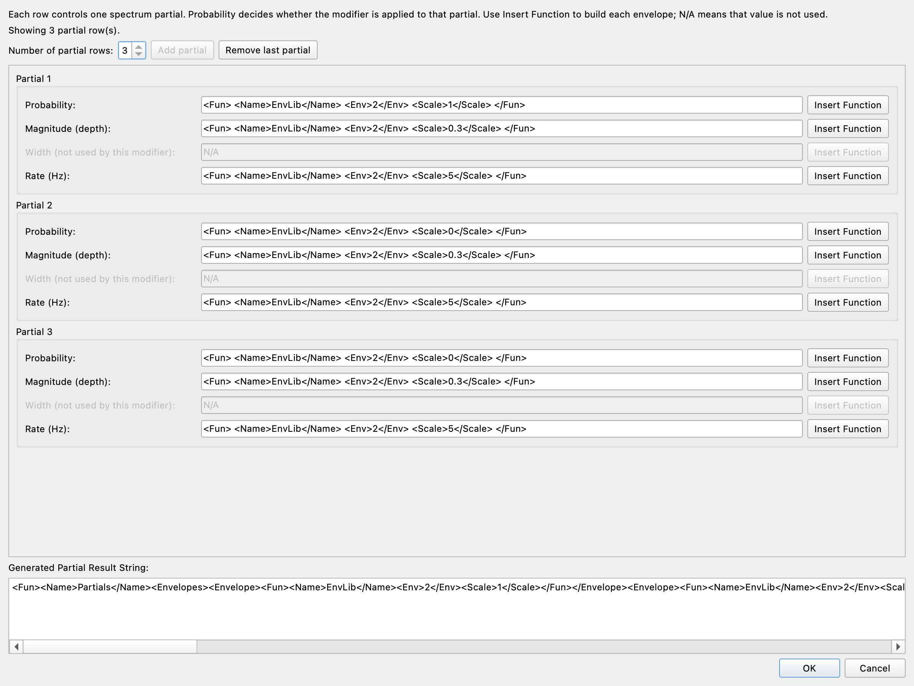

**Generated Partial Result String** shows the complete expression on one line. Scroll horizontally to read it; change values in the partial rows above, then click **OK**.

In PARTIAL mode, SOUND fields are disabled. Row 1 addresses spectrum partial 1, and so on; unlisted partials receive no effect. **Add partial** and **Remove last partial** change modifier rows, not the spectrum itself. Add partial stops at the known spectrum count.

Each row's **Probability** uses 0–1: `1` always, `0` never, `0.5` a 50% chance. N/A also leaves the partial unaffected. The modifier's overall Default ON chance must select the effect before these partial probabilities apply.

For **DETUNE in PARTIAL mode**, the row's detuning envelope is a frequency multiplier: `1` preserves tuning and `1.01` raises that partial by about 1%. This is a different control from SOUND mode's Spread, Direction, and Velocity.

**Listen checkpoint — select the affected partial.** Run the configured PARTIAL tremolo, then change only Partial 1's Probability envelope scale from `1` to `0` and run again. The first version modulates the fundamental while the upper components remain steady; the second leaves all three steady. If no difference is apparent, check the overall Default ON chance `100%`, the first row's Probability, and the spectrum's three actual partials. Restore Probability scale `1` after comparing.

## 20. Control modifier chances and exceptions

After hearing individual effects at 100%, use their chances to create variety. The main **Default ON chance** and **Use ON chance** controls display percentages: enter `50` for 50%. Inside a partial's Probability envelope, the equivalent value is `0.5`. A 50% chance applies to each selection; it does not guarantee that exactly half of a five-sound run will use the effect.

### Prepare five separate tones

Start from a fresh `tutorial_sound.dissco` copy. In **Bottom s1**, enter all these settings; keep Top 0 and the one-partial Spectrum sp1 unchanged.

| Setting | Value |
| --- | --- |
| Number of Children | **Fixed**, `5` |
| Children Events Definition | **Sweep** |
| Child Start Time / Child Type | `0` / `0` |
| Start Time unit / Duration unit | **Seconds** / **Seconds** |
| Child Duration / Max Child Duration | `1` / `1` |
| Frequency | **Continuum > Hertz**, Value `440` |
| Spatialization | **Stereo / Sound / EnvLib 2 / Scale 0.5** |
| Reverb / Filter(Optional) | Empty |
| Modifiers | No rows |

Run: five centered one-second tones should begin at 0, 1, 2, 3, and 4 seconds. This is also the **five separate tones** setup used in sections 21–22. If they overlap or start at random times, recheck Sweep and both Seconds selections.

### Choose the sampling scope

In Bottom's **Modifier selection** area:

- **Per sound** makes a fresh modifier selection for each sound created by this Bottom event.
- **Once per Bottom event** makes one selection that its sounds share. A later instance of that Bottom event can make a different selection.

These settings control which modifier rows are ON. A PARTIAL modifier's probability envelopes still provide a second selection step for its partials.

### Work with ordered rows

Modifiers are evaluated in list order; use the up/down controls to reorder them. Exceptions can refer only to earlier rows. Chances do not have to total 100%, since several effects can be ON. Start with one row per type: a later active row of the same type can replace earlier parameters.

### Make two effects mutually exclusive

Keep the five separate tones setup and choose **Sampling scope: Per sound**. These rules give each tone either tremolo or vibrato:

1. Add **TREMOLO first**, with **Default ON chance = 50%**. In Parameters, select **SOUND** and use constant envelopes of `0.3` for Magnitude and `5` for Rate.
2. Add **VIBRATO second**, with **Default ON chance = 100%**. Select **SOUND** and use constant envelopes of `0.01` for Magnitude and `5` for Rate.
3. In the Vibrato row, click **No exceptions** and then **+ Add exception**.
4. For the earlier Tremolo, choose **ON**. Set **Use ON chance** to `0%`.
5. Accept the exception, the exceptions list, and any remaining parameter dialogs.

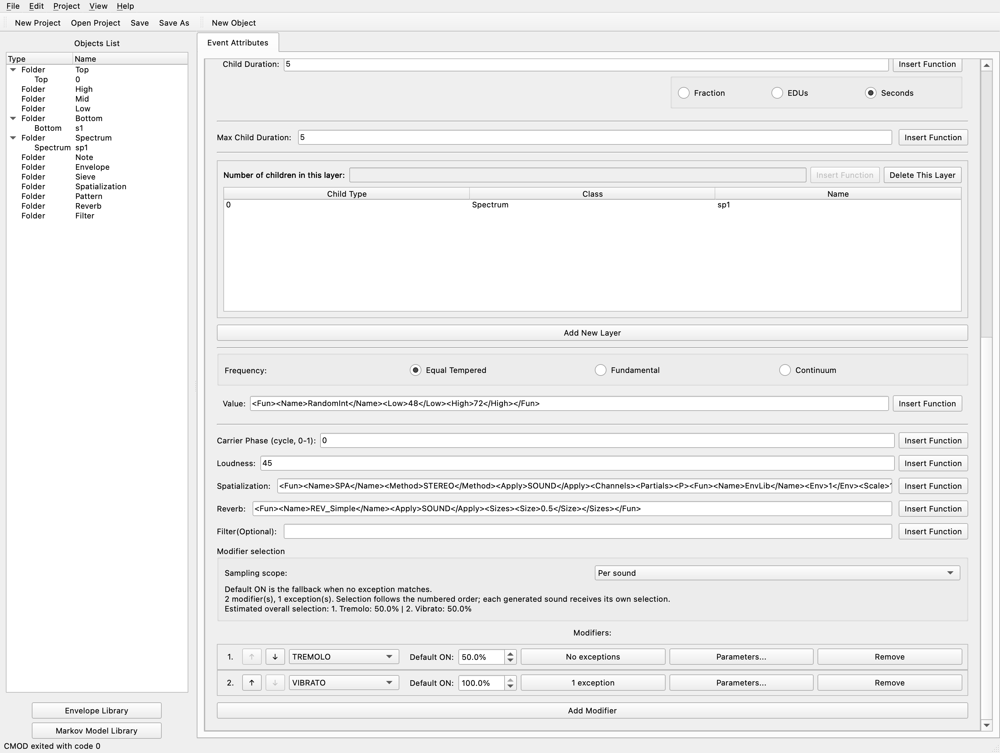

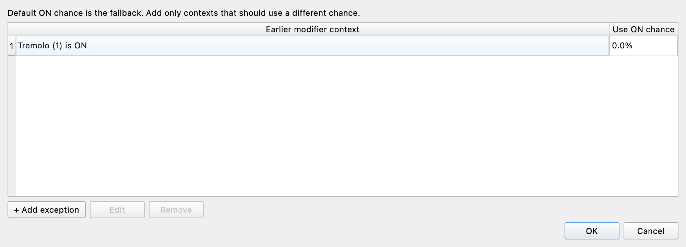

When Tremolo is ON, the exception turns Vibrato OFF. When Tremolo is OFF, Vibrato keeps its default 100% chance. **Any** means that an earlier modifier's state is ignored. Select **ON** or **OFF** for at least one earlier modifier when defining an exception.

Use **Edit** or **Remove** to change rules. Avoid conflicting conditions and recheck exceptions after reordering or deleting rows.

**Listen checkpoint — hear the selection rule.** Run the two-row example. Each of the five separate tones should have either tremolo (loudness pulses) or vibrato (pitch wavering). To check the exception deterministically, set Tremolo's Default ON chance to `100%` and run: only tremolo should be active. Set it to `0%` and run: only vibrato should be active. If both effects occur on one tone, check row order and Vibrato's exception. Restore Tremolo to `50%`. Then compare **Per sound** with **Once per Bottom event**: the latter gives all five sounds the same selected effect. One Per sound run can also select the same effect five times by chance; try another seed before judging that scope.

## 21. Arrange a longer piece

### Repeat the Bottom event

You can make a more complex piece without changing the sound itself:

1. Open the completed beginner project and use **File > Save As** to make a copy for this exercise.
2. In **Project > Set Properties**, change Piece Duration to `60`.
3. In **Top 0**, set Number of Children To Create to `10`.
4. Set Top's Child Start Time to **Random**, bounds `0` and `30`, with **Seconds** selected.
5. Keep Top's Child Duration and Max Child Duration at `30`, and Child Type at `0`.
6. Leave Bottom s1 at five sounds.

This creates **10 Bottom instances × 5 sounds = 50 sounds**. The last possible Bottom starts at second 30 and occupies 30 seconds. Overlap makes this version denser, and rendering takes more work.

**Listen checkpoint — a denser piece.** Run and compare with the five-tone project. Listen for a thicker texture and more overlapping entries. You do not need to count 50 sounds by ear: check the `.particel` report for ten Bottom instances and their Sound entries. If the texture is unchanged, verify that you changed Top's count to `10`, leaving Bottom's count at `5`.

### Use the event hierarchy

**High**, **Mid**, and **Low** are optional levels between Top and Bottom. Create them with **New Object**, configure their children just as you configured Top, and drag child objects into their tables. For example:

**Top → High (section) → Low (phrase) → Bottom (sounds) → Spectrum**.

You can skip levels. Keep the hierarchy moving toward Bottom and Spectrum, and avoid linking an ancestor back underneath one of its descendants.

### Choose how many children to create

| Method | What you enter | Use |
| --- | --- | --- |
| **Fixed** | Number of Children To Create | A known total, such as five sounds. |
| **Density** | Density, Area, Under One | A count based on the parent's duration and a density scale. |
| **By Layer** | A child count for each layer | Separate quantities for different layers. |

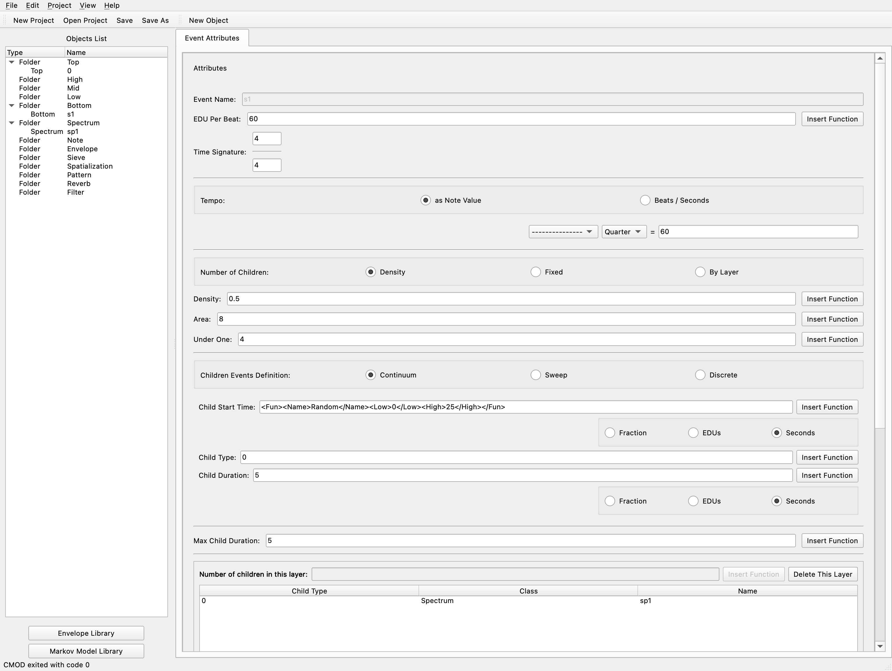

For the Density exercise, open a fresh `tutorial_sound.dissco` copy. In **Bottom s1**, select **Density** and enter Density `0.5`, Area `8`, Under One `4`. Together these give approximately one child per second of the 30-second Bottom. Density `0.5` alone does not mean half a sound per second. Area must be nonzero; use Fixed for an exact count.

**Listen checkpoint — density.** Run at Density `0.5`, then at `0.25`, keeping Area, Under One, and the other fields fixed. The second version should contain fewer sounds. If overlap makes the difference hard to hear, compare the Sound entries in the two `.particel` reports. Restore a fresh beginner copy before the next timing experiment.

### Choose how start times and durations are made

| Method | Behavior | Starting exercise |
| --- | --- | --- |
| **Continuum** | Calculates children's times independently; overlap is possible. | The Random start times from the beginner example. |
| **Sweep** | Places children in sequence from the parent's start; this numeric exercise uses the previous child's end. | Follow the complete [five separate tones setup](#prepare-five-separate-tones). |
| **Discrete** | Chooses among allowed attacks, types, and durations while avoiding overlapping events within a layer. An **attack** is a sound's start time. | Select Discrete to reveal Attack Sieve and Duration Sieve, then fill the [worked sieve example](#make-a-sieve-of-allowed-values) before running. |

**Listen checkpoint — sequential timing.** Run the [five separate tones setup](#prepare-five-separate-tones). You should hear five one-second sounds in order, unlike the scattered starts of the original piece. Check Sweep and Seconds if the timing is wrong. Adding reverb afterward can make tails overlap even though the start times remain sequential.

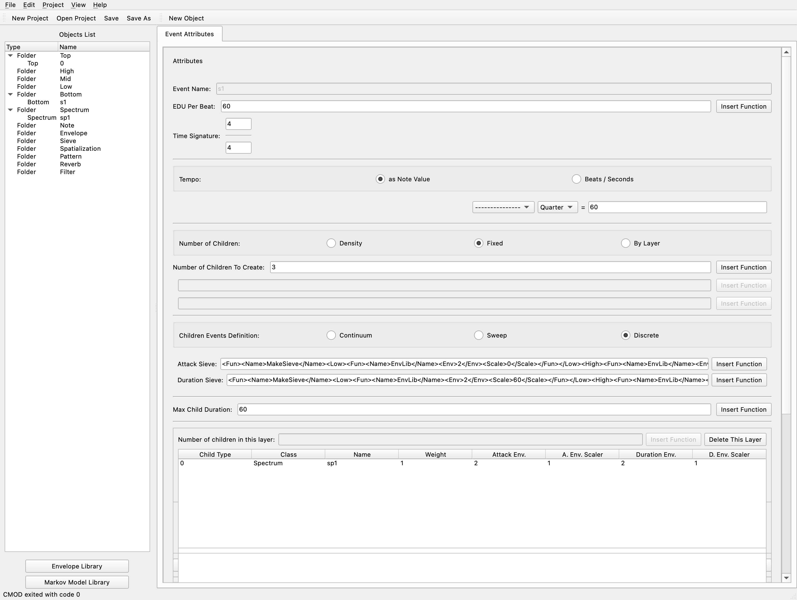

For Continuum and Sweep, explicitly select units:

- **Seconds:** ordinary elapsed seconds relative to the parent.
- **Fraction:** a fraction of the parent's duration; `0.5` means halfway through it for a start, or half its duration for a duration.
- **EDUs:** Elementary Displacement Units, subdivisions of the beat. With **60 EDU Per Beat** and **quarter note = 60**, 60 EDUs is one second and 30 EDUs is half a second.

**Max Child Duration has its own unit rule.** In Continuum or Sweep, it is measured in **seconds** when Child Duration uses Seconds **or Fraction**. It is measured in **EDUs** when Child Duration uses EDUs. Discrete also uses EDUs. For example, in a 30-second parent, Child Duration `0.5` with Fraction means 15 seconds, so use Max Child Duration `15` to allow the full duration. Max Child Duration `0.5` would cap that sound at half a second.

Discrete replaces the Continuum/Sweep timing fields, so their Seconds/Fraction/EDUs buttons are no longer shown. The sieve values and Max Child Duration are in EDUs in this mode. Use **EDU Per Beat `60`** and **quarter note = 60** for the worked Discrete example.

### Work with layers and child packages

Use **Add New Layer** to create another child table. A layer groups related types, such as two different spectra or two kinds of phrase. Drag the available child objects into the intended layer. The displayed **Child Type** numbers identify those rows; use a valid number, or an appropriate selection function, in **Child Type**.

For Continuum, adding a second type does not automatically make Child Type `0` choose it. If the two displayed types are `0` and `1`, use **RandomInt**, Lower Bound `0`, Upper Bound `1`, in Child Type to choose between them.

In Discrete mode, the child table includes **Weight**, **Attack Envelope**, **Attack Envelope Scale**, **Duration Envelope**, and **Duration Envelope Scale**. Weight affects type selection. The two envelopes shape preferences over the allowed attacks and durations. Supply valid library envelope numbers and scales. Different layers can overlap; collision avoidance applies within a layer. Finish a cell edit by pressing Tab or clicking another cell.

## 22. Use functions, patterns, sieves, and Markov models

Functions can return a different value for each child. The receiving field's units still apply: a Random result in Child Start Time uses its selected Seconds, Fraction, or EDUs.

**Start each example from a fresh `tutorial_sound.dissco` copy.** For pitch experiments, apply the [five separate tones setup](#prepare-five-separate-tones), then select **Bottom s1 > Frequency > Equal Tempered** and replace its Value with the stated function. Do not Run with the old Hertz value `440` after switching modes. The Discrete exercise below replaces the timing setup instead.

Where an envelope is required, use [constant Envelope 2](#make-a-constant-envelope-for-effect-parameters) with the stated Scale, unless MakeEnvelope is specified.

### Choose pitches from a list with Select

1. Beside Bottom's **Equal Tempered > Value**, open Function Generator and choose **Select**.
2. Use **Add New Node** until there are three list rows. Enter `48`, `52`, and `55`.
3. In **Choice Index**, insert **RandomInt**, bounds `0` and `2`. Accept both dialogs.

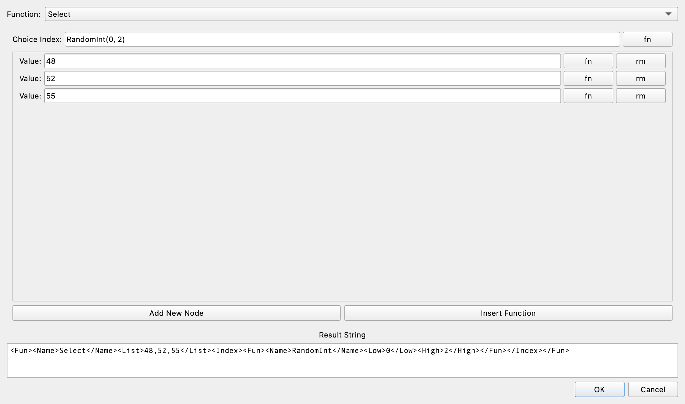

Indices start at **0**: indices 0, 1, and 2 choose 48, 52, and 55. Update the index range if you remove a list row; index 3 is outside this list.

**Listen checkpoint — a restricted pitch set.** Run. All five pitches should be C4, E4, or G4; repeats are allowed. For a reference by ear, replace Choice Index with `0` and Run for C4, then use `1` and `2` for E4 and G4. Restore RandomInt `0`–`2`. An out-of-range error means the list length and index bounds disagree.

### Shape randomness with Stochos

Stochos envelopes can change a random range or its choices through an event.

For **Range Distribution**, choose **Stochos** in Equal Tempered Value and select **Range Distribution**. Click **Add New Node** once for a Min/Max/Distribution group. Click the receiving field before using the bottom **Insert Function** button.

| Field | Value |
| --- | --- |
| Offset | Leave blank; the disabled field defaults to the first group. |
| Min | Constant envelope `48` |
| Max | Constant envelope `72` |
| Distribution | MakeEnvelope `(0, 0)` to `(1, 1)`, Linear, Flexible, Scale `1` |

Accept the nested dialogs and Stochos. This linear Distribution gives an even spread before Equal Tempered discards fractional semitones. Moving Min/Max envelopes change the range over time; keep Min at or below Max.

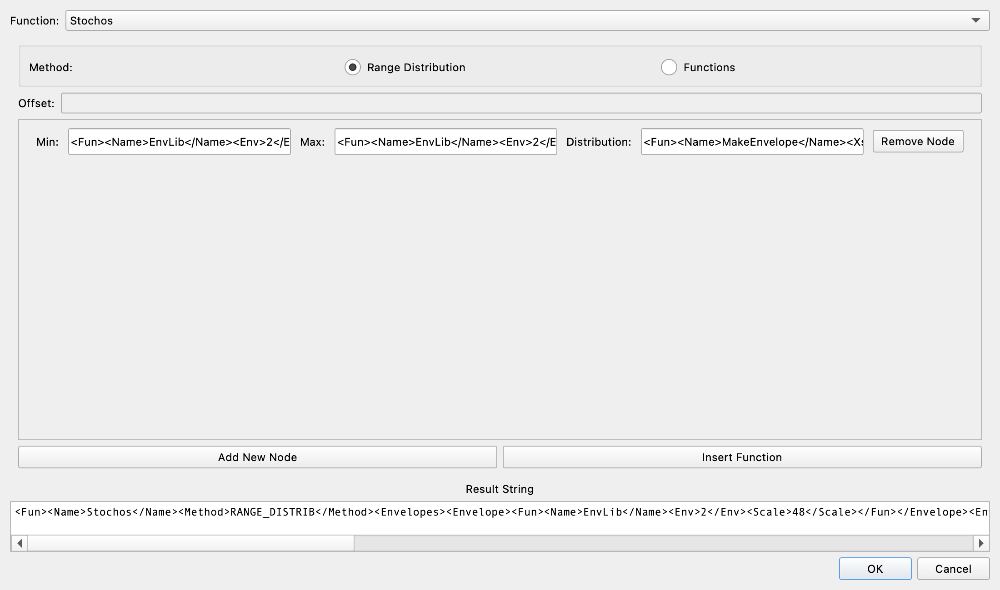

**Listen checkpoint — a pitch range.** Run for five pitches across C4–C6. Check Min/Max scales and Equal Tempered if a pitch is outside that range. Five sounds cannot establish a probability distribution; additional seeds let you explore its variety.

For **Functions** mode, start another fresh copy with the [three-pitch Select setup](#choose-pitches-from-a-list-with-select). Replace Select's **Choice Index** with **Stochos**. Choose **Functions** before adding rows; changing modes clears them. Add three rows with constant envelopes `0.333333`, `0.666667`, and `1`.

These are **cumulative thresholds**, dividing 0–1 into three equal regions that return indices 0, 1, and 2. They are not probabilities to add together. Keep thresholds increasing and end at `1`. With just one envelope, Functions mode returns that envelope's value instead of choosing an index.

**Listen checkpoint — listed choices.** Run. Select now maps those indices to C4, E4, or G4, with repeats allowed. Compare with the range example: intermediate semitone pitches are no longer choices. If another pitch occurs, check Select's list and the three threshold envelopes.

### Make a sieve of allowed values

A **sieve** supplies allowed numbers and selection weights. Weights `1, 1` give equal preference; `1, 2` favors the second choice. MakeSieve takes nonnegative whole-number weights, at least one positive.

In a numeric field, insert **ChooseL**, then **MakeSieve** inside it to choose a number. In Discrete timing, insert MakeSieve directly into Attack Sieve and Duration Sieve:

1. Start a fresh `tutorial_sound.dissco` copy. Open **Bottom s1**; keep its Spectrum sp1 child.
2. Set **EDU Per Beat = 60** and **Tempo = as Note Value**, **Quarter = 60**, with no dotted-note option. Here 60 EDUs equals one second.
3. Select **Fixed**, count `3`, then **Children Events Definition > Discrete**. Set **Max Child Duration = 60**. The new sieve fields and this maximum use EDUs.
4. In **Attack Sieve**, insert **MakeSieve** and fill the table. Use EnvLib Number `2` with the listed Scale for each bound; type lists directly.

| MakeSieve field | Attack Sieve |
| --- | --- |
| Low Bound / High Bound | Constant envelopes `0` / `180` |
| Elements Method / Elements Values | **MEANINGFUL** / `0, 60, 120, 180` |
| Weights Method / Weights Values | **INCLUDE** / `1, 1, 1, 1` |
| Offset | `0` |

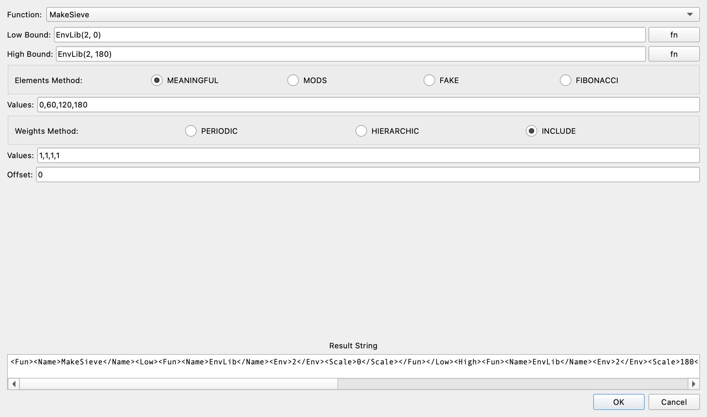

5. Accept Attack Sieve. In **Duration Sieve**, insert MakeSieve: Low and High constant envelopes `60`, Elements **MEANINGFUL**, Values `60`, Weights **INCLUDE**, Values `1`, Offset `0`. Accept.
6. In Spectrum sp1's child-table row (its **child package**), set Weight `1`, Attack Envelope `2`, Duration Envelope `2`, and both envelope scales `1`. These table cells take library numbers directly.

**Listen checkpoint — allowed start times.** Run: three one-second sounds occupy three of the attacks at 0, 1, 2, and 3 seconds. Pitch and position still vary, and reverb tails may overlap. To verify attacks precisely, check the `.particel` report. Wrong timing calls for checking tempo, EDUs, and sieve values; a placement error calls for checking count `3`, durations, and both package envelope numbers.

Other sieve options:

| Setting | Meaning |
| --- | --- |
| Elements **MEANINGFUL** | Listed values within the bounds. |
| Elements **MODS** | Integer spacings (moduli), shifted by offsets and limited by bounds. Begin with one modulus. |
| Elements **FAKE** | Every integer between the bounds. |
| Weights **INCLUDE** | One nonnegative integer weight per value; at least one positive. |
| Weights **PERIODIC** | Repeating weights over the values. |
| Weights **HIERARCHIC** | Weights associated with modular classes; use with MODS. |

Sieve **FIBONACCI** is unsupported in the current engine. The separate numeric **Fibonacci** function works; it has a different purpose.

### Pick pitches within a bounded range with ValuePick

Start from the five separate tones setup, switch to Equal Tempered, and choose **ValuePick** in Value. It combines a sieve with envelopes controlling its bounds and weights.

| Field | Value |
| --- | --- |
| Absolute Range | `96` |
| Low / High | Constant envelopes `0.5` / `0.75` |
| Distribution | Constant envelope `1` |
| Elements Method / Elements Values | **MEANINGFUL** / `48, 60, 72` |
| Weights Method / Weights Values | **INCLUDE** / `1, 1, 1` |
| Type | **CONSTANT** |
| Offset | `0, 0, 0` — one per element |

The bounds are `96 × 0.5 = 48` and `96 × 0.75 = 72`, admitting all three pitches. **CONSTANT** uses the Distribution curve's height to adjust weights; **VARIABLE** also transforms it by the choice's list position. CONSTANT does not mean a fixed output pitch. Avoid the unsupported FIBONACCI element method.

**Listen checkpoint — bounded pitch selection.** Accept and Run: only C4, C5, or C6 should occur. Change High to constant `0.5` and Run again: only C4 remains. If not, check Equal Tempered, Absolute Range, and the bound scales. Restore High to `0.75`.

### Make a repeating pitch pattern

Use a fresh copy and the five separate tones setup, then:

1. In **Bottom s1 > Equal Tempered > Value**, choose **GetPattern**.
2. Select **IN_ORDER**, Origin `48`.
3. In **Pattern to choose from**, insert **MakePattern**, Intervals `4, 3, 5`. Accept both dialogs.

Intervals are successive semitone steps: starting at 48, this yields `48, 52, 55, 60`, then returns to `48`. Changing Origin transposes the pattern.

**Listen checkpoint — an ordered pattern.** Run **before adding ExpandPattern**. Listen for C4, E4, G4, C5, C4. Check Sweep and IN_ORDER if the order differs; check Origin and Intervals if pitches differ.

To try **ExpandPattern**, reopen GetPattern and replace **Pattern to choose from** with ExpandPattern. Choose **EQUIVALENCE**, Modulo `12`, Low `48`, High `72`. In its **Pattern** field, insert MakePattern, Intervals `4, 3, 5`. Accept all three dialogs and Run. Pitches can move by octaves within the bounds; the original octave sequence is no longer expected. Expansion chooses equivalent pitches rather than appending every possible octave to the list.

**Supported modes:** GetPattern supports IN_ORDER, not OTHER, TYPE_CLUSTERS, TIME_DEPEND, or PROBABILITY. ExpandPattern supports EQUIVALENCE, not SYMMETRIES or DISTORT.

### Use a Markov model

A Markov model chooses its next **state** from its current state. Each state has an output value, such as a pitch. Start with the five separate tones setup.

1. Open **Markov Model Library**, click **+**, and note the model **id** in the left list.
2. Set **Markov chain size = 3** and click **Set**.
3. In **Values for states**, enter `48`, `55`, `60`, one per cell.
4. In **Initial Distribution**, enter `1`, `0`, `0` to start in state 1.
5. Fill the transition matrix, one row per current state:

| Current state | Next state 1 | Next state 2 | Next state 3 |
| --- | --- | --- | --- |
| 1 | `0` | `1` | `0` |
| 2 | `0` | `0` | `1` |
| 3 | `1` | `0` | `0` |

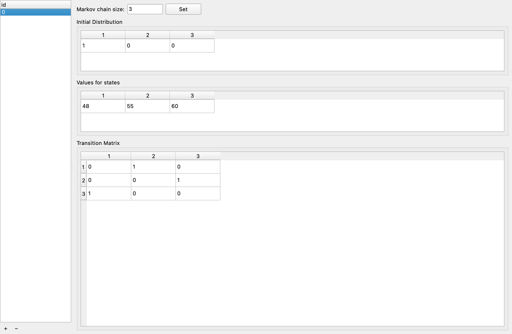

6. Press Tab to finish the last cell, close the library, and Save.
7. In **Bottom s1 > Equal Tempered > Value**, insert **GetFromMarkovChain** with the recorded **Markov Model Id**. The model id starts at 0; it is distinct from state columns 1–3.

**Listen checkpoint — the Markov cycle.** Run: the five tones should be C4, G4, C5, C4, G4. If not, check Sweep, model id, and matrix entries. To introduce randomness, change the first row to `0, 0.7, 0.3` and Run again. Keep all entries nonnegative and each row's sum at `1`.

Library controls also create, duplicate, copy, paste, and delete models. Table cells support copy/paste, and library edits support undo/redo. Check references before deleting or resizing a model.

### Function reference

The table below accounts for the numeric and selection helpers in Function Generator. For builders and references, see the second table.

| Function | Purpose and useful starting point |
| --- | --- |
| **Random** | A random number between Lower and Upper Bound; `0` to `25` seconds for the five-tone piece in section 10. |
| **RandomInt** | A random integer, including the bounds; `48` to `72` for semitone pitches. |
| **RandomOrderInt** | Draw every integer in a range in random order before refilling the pool. Bounds `48` and `50` use 48, 49, and 50 once each per cycle. LASSIE manages the pool identifier. |
| **Randomizer** | Perturb a Base by a relative Deviation. Base `440`, Deviation `0.01` varies around 440 Hz by up to about 1%. |
| **RandomDensity** | Use a library curve to favor some values in a range. For Bottom's Child Start Time in Seconds, enter **Envelope Id `1`**, **Start Time `0`**, and **End Time `25`**. The triangle favors times near the middle. Enter the library number directly in Envelope Id, even though an envelope function button is shown. |
| **Select** | Choose a listed value using a Choice Index that starts at 0; see [Choose pitches from a list](#choose-pitches-from-a-list-with-select). |
| **Stochos** | Use Range Distribution or Functions mode to shape random choices with envelopes. |
| **ValuePick** | Pick from a sieve within bounds set by Low and High envelopes multiplied by Absolute Range; see [the worked ValuePick settings](#pick-pitches-within-a-bounded-range-with-valuepick). |
| **ChooseL** | Choose a weighted number from a sieve, such as a MakeSieve or ReadSIVFile result. |
| **GetFromMarkovChain** | Return a value from the numbered Markov model; see [Use a Markov model](#use-a-markov-model). |
| **GetPattern** | Get the next pattern value; use IN_ORDER. |
| **Inverse** | Return 1 divided by the input: input `4` gives `0.25`. Use a nonzero input. |
| **LN** | Return the natural logarithm: input `1` gives `0`. Use a positive input and check that the result is suitable for the receiving field. |
| **Fibonacci** | Return a Fibonacci value. Use a nonnegative integer index no greater than `46`. |
| **Decay** | **Linear** gives Base − Rate × Index; **Exponential** gives Base × Rate^Index. For decreasing loudness, try Exponential, Base `64`, Rate `0.5`, and Index **CURRENT_CHILD_NUM** inserted with the function button: successive children receive 64, 32, 16, and so on. |
| **CURRENT_CHILD_NUM** | Current child index, starting at 0. Use it when successive children should receive different values. |
| **CURRENT_TYPE** | Current child type number, corresponding to the Child Type column of the parent's child table. |
| **PREVIOUS_CHILD_DURATION** | Despite its name, returns the previous child’s **end time** in the current event’s raw timing units. It is not simply the last child’s duration. |
| **AVAILABLE_EDU** | Available duration expressed in EDUs in an event context. |
| **CURRENT_PARTIAL_NUM** | Current partial index in partial construction; the internal index begins at 0 although the visible partial rows begin at 1. |
| **CURRENT_SEGMENT** | Not implemented in this engine: it reports a warning and returns `0`. Use an explicit value or supported expression. |
| **CURRENT_LAYER** | Current layer index in event generation, starting at 0. |

Supported context functions need the corresponding event, partial, or layer to exist. Do not use them in global Project Properties simply because they appear in a function list. Start with a literal value in that setting.

| Builder or reference | Where to learn it / current behavior |
| --- | --- |
| **EnvLib**, **MakeEnvelope** | [Envelope Library references and inline curves](#13-work-with-envelopes). |
| **Generate_Spectrum** | [Automatically generated partials](#generate-spectrum). |
| **SPA** | [Stereo, Multi-Pan, and Polar placement](#15-place-sounds-in-space). |
| **REV_Simple**, **REV_Medium**, **REV_Advanced** | [Reverb models](#16-add-reverberation). |
| **MakeFilter** | [Seven filter types](#17-shape-the-tone-with-filters). |
| **MakeSieve** | [Allowed values and weights](#make-a-sieve-of-allowed-values). |
| **MakePattern**, **ExpandPattern** | [Interval patterns and equivalence](#make-a-repeating-pitch-pattern). |
| **ReadENVFile**, **ReadSIVFile**, **ReadPATFile**, **ReadSPAFile**, **ReadREVFile**, **ReadFILFile** | [Reuse named objects](#23-reuse-objects-and-manage-projects). |
| **MakeList** | Present in the editor with Function and Size fields, but list generation is not implemented for a usable current CMOD workflow. Use explicit list entries, such as Select's Add New Node rows. |

## 23. Reuse objects and manage projects

### Store a sound setting as a named object

The **Envelope**, **Sieve**, **Spatialization**, **Pattern**, **Reverb**, and **Filter** folders hold reusable definitions. This is useful when several Bottom events should share the same setting.

For this comparison, start from a fresh **first_tone.dissco** copy. In Bottom s1, insert **REV_Simple / Sound / Room Size 0.5** and Run **before replacing it**. Keep this audio, then make the reusable room:

1. Select **Reverb** in Objects List and click **New Object**.
2. In Create New Object, select **Reverb**, name it `room1`, and click **OK**.
3. Double-click the new Reverb object. In **Reverberation**, insert **REV_Simple**, Apply To Sound, Room Size `0.5`.
4. Open Bottom s1's Reverb field with **Insert Function**. Choose **ReadREVFile**, enter `room1` in **REV File Name**, and click **OK**.

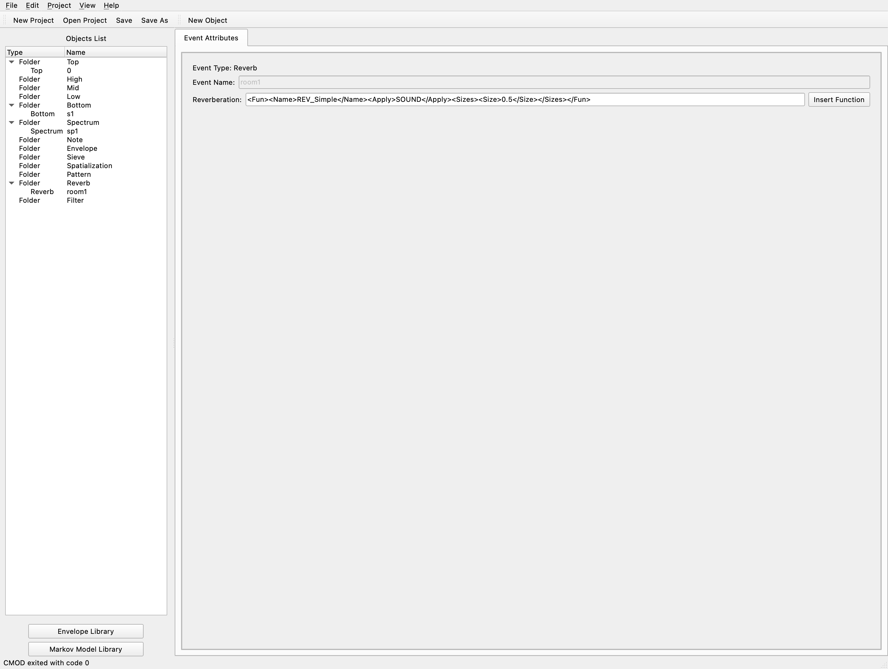

**Listen checkpoint — the same room, reused.** Run with the room1 reference and compare with the audio saved before replacement. The sound should remain the same. If Run fails or the tail changes, check the exact name `room1` and its stored settings.

Despite the word **File** in the function names, this workflow refers to a named definition in the project. Enter the object's exact name. An **Envelope object** read with ReadENVFile is distinct from a numbered **Envelope Library** entry read with EnvLib.

Use the matching pairs:

| Folder | Builder in the object | Reference in the receiving field |
| --- | --- | --- |
| Envelope | MakeEnvelope or another valid envelope expression | ReadENVFile |
| Sieve | MakeSieve | ReadSIVFile |
| Pattern | MakePattern or supported ExpandPattern | ReadPATFile |
| Spatialization | SPA | ReadSPAFile |
| Reverb | A REV function | ReadREVFile |
| Filter | MakeFilter | ReadFILFile |

An **ancestor** is a parent or any event above it in the hierarchy; Top 0 is an ancestor of Bottom s1. Spatialization, reverb, and filter settings on ancestors can pass down to children. If a sound has an unexpected effect, inspect those higher events as well as Bottom. Ancestor modifiers can also participate in the sound's modifier program. Keep these fields empty in Top 0 for the beginner project so that all of its sound controls come from Bottom s1.

### Save and organize your work

- **Save** updates the current file. **File > Save As** switches to a new file, preserving the original. Choose a separate folder for each experiment to keep its output easy to find.
- **Open Project** reopens a `.dissco` file; the welcome page also lists recent projects.
- To copy an event, select its object row, then use **Copy** and **Paste**. Use **Cmd** on macOS or **Ctrl** on Windows/Linux for the displayed shortcuts. Focus inside a text field copies text; focus in Objects List copies the event.
- The object context menu also offers **Duplicate** and **Delete**. Check child tables and references after renaming or deleting an object. A Top event is the project's root and is not duplicated like an ordinary child object.
- Keep a project together with its supporting files and output folders. Make a backup before moving or renaming a project folder, and reopen it from its new location afterward.

**Save-and-return checkpoint.** Save this exercise, close it, reopen the same `.dissco` file, and run with the same seed. Confirm that its functions and named references are still present and that the new output matches the saved configuration. If settings are missing, check which project file you reopened, finish any pending field edits, and save again. This is a useful stopping point before returning for another experiment.

## 24. Troubleshooting and final checklist

### No audio file appears

Check **Sound Synthesis** in Project Properties. Save, run again, and inspect the run window's error message. Confirm that you are looking inside this project's **SoundFiles** folder and opening the newest numbered AIFF, not an older run's output.

### A file exists but is silent

Check these in order:

1. **Top 0** has a positive child count and links to **Bottom s1**.
2. **Bottom s1** has a positive child count and links to **Spectrum sp1**.
3. Both events have positive durations and valid Child Type numbers.
4. At least one spectrum partial has a nonzero envelope and scaling factor.
5. Bottom's Loudness is positive and its frequency value matches the selected mode, for example Equal Tempered `48` or Continuum > Hertz `440`.
6. Spatialization and filter settings are not suppressing the signal.

A run can finish successfully while producing silence; check the waveform or play the file as well as reading **Build complete**.

### The beginning is silent, or the file length is unexpected

Random start times can leave an initial gap. Check **Seconds / Fraction / EDUs** in the event that creates those sounds. The last sound and its reverb tail determine the end of the rendered audio; it need not be exactly the Piece Duration.

### A function does not seem to work

Reopen the function with **Insert Function**. Check whether the field expects a number, an envelope, or another object, and check its units. Accept every nested dialog, press Tab to finish the field edit, and click **Save**. Verify each identifier against its own list: an EnvLib Envelope Number refers to Envelope Library, while a Markov Model Id refers to Markov Model Library. For choices listed as unsupported in [section 22](#22-use-functions-patterns-sieves-and-markov-models), use the supported alternative given there.

### A modifier has no audible effect

Set its Default ON chance to 100%, remove any conditional exceptions for that test, choose SOUND, and remove other modifier rows. Fill all the selected modifier's required parameters. If using PARTIAL, open Customize, check the partial rows and Probability values, and make sure those partials exist in the spectrum. A phase change or a small detune may be subtle; use the [three-partial comparison](#add-and-remove-partials) to make differences easier to assess.

### The Discrete run cannot place the requested children

Request fewer children, provide more attack choices, shorten allowed durations, or use more layers. Every allowed duration must fit the event and Max Child Duration. Check that the sieves and package envelopes exist and that the weights permit a selection.

### A label or parameter is missing

Enlarge the window and scroll **Event Attributes**. Some controls change when you switch Frequency mode, event-definition method, modifier type, or Sound/Partial application. A grey field is not active in the current mode.

### Before sharing a project

- Save, close, and reopen it to check persistence.
- Run it with a recorded seed and check that a new audio file is created.
- Listen to or inspect the actual output, including its loudest passages.
- Keep the `.dissco` project, any needed supporting files, and the intended audio output together.
- State any multichannel speaker requirements separately from the file's channel count.
